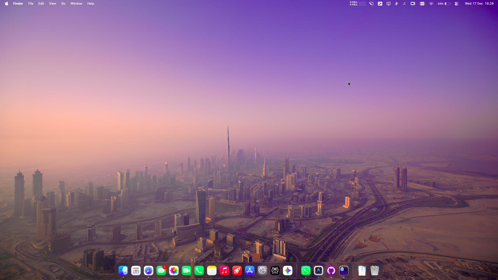
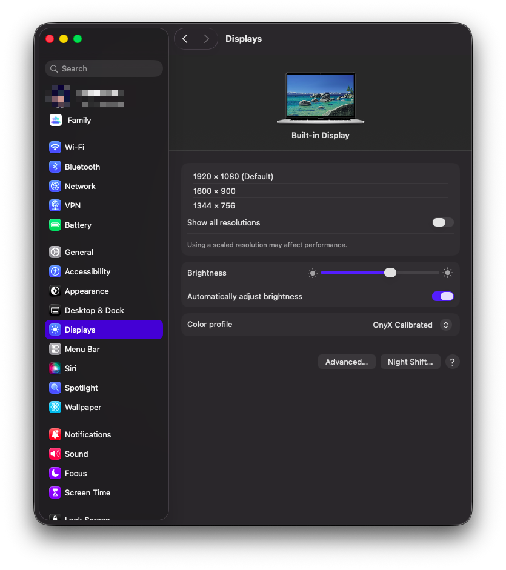
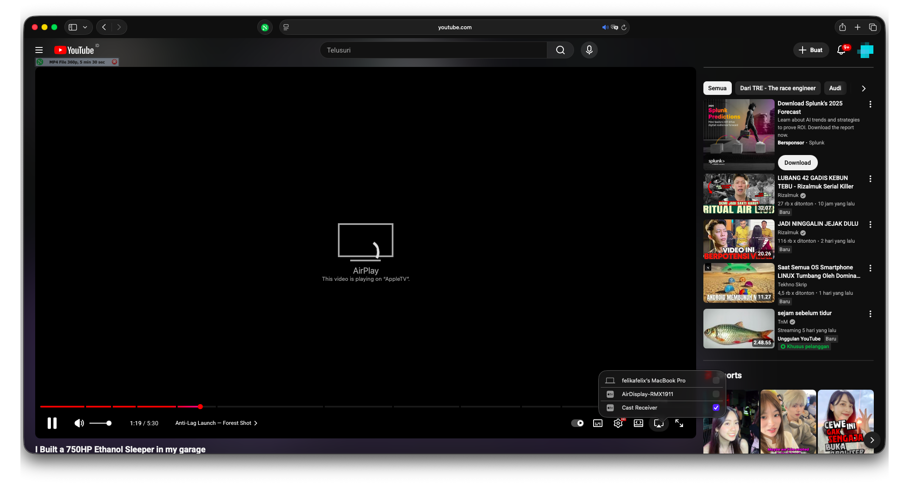
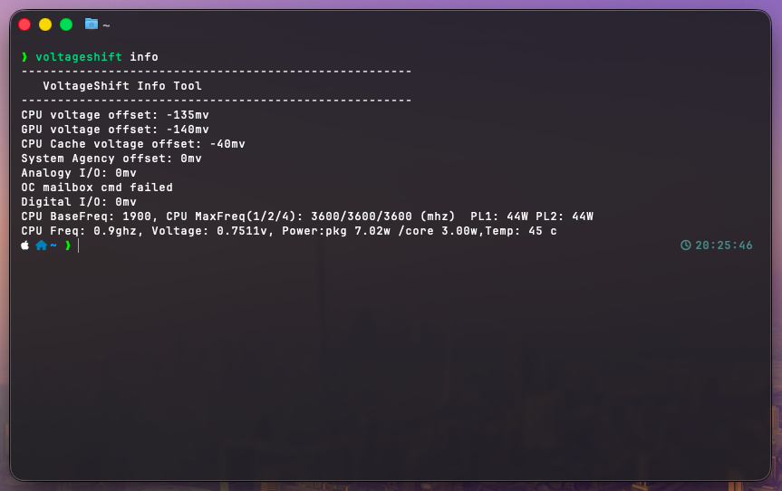
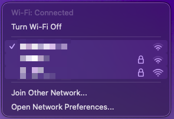
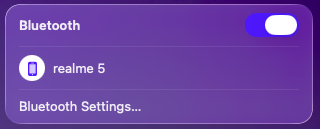
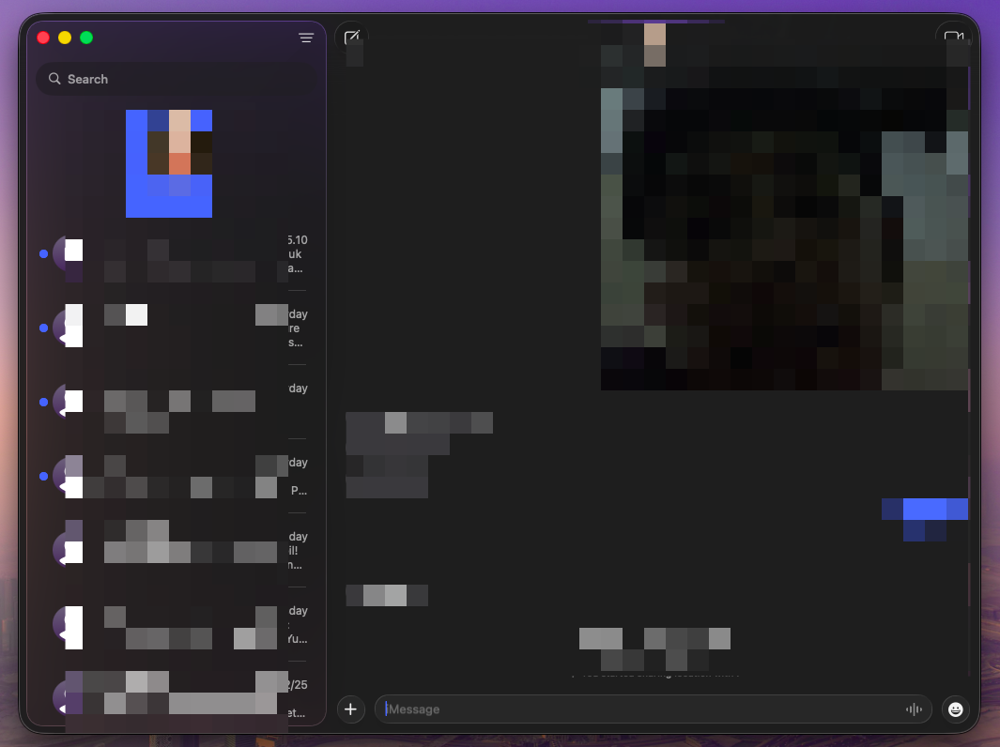
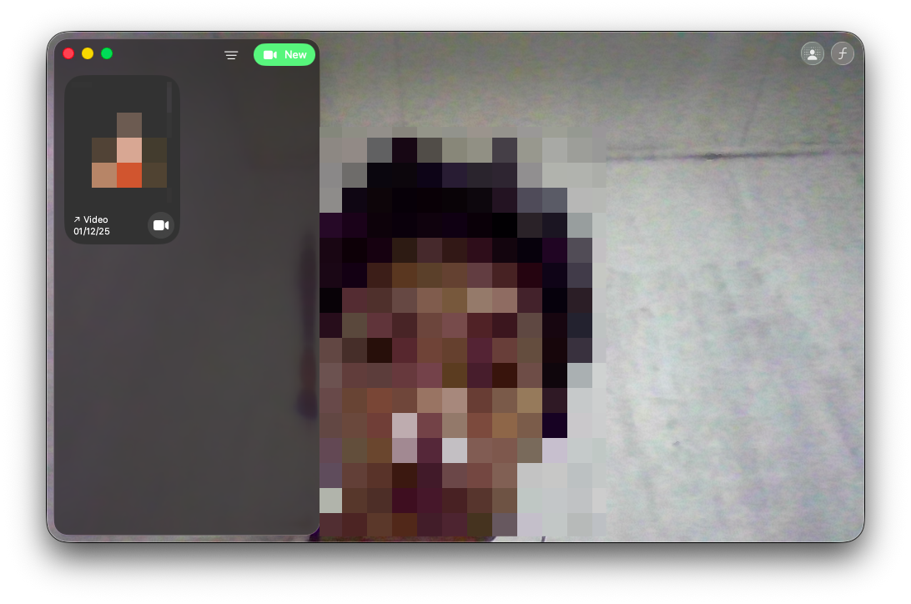

# <div align="center"> Hackintosh-Thinkpad-T480s </div>

<p align="center">
<!-- OpenCore 1.0.5 -->
<a href="https://github.com/acidanthera/OpenCorePkg/releases/tag/1.0.5">

</a>
<!-- Status Stable -->

<!-- Downloads -->
<a href="https://github.com/felikafelix/Hackintosh-Thinkpad-T480s/releases">

</a>
</p>

<p align="center">
<!-- Ventura -->
<a href="https://github.com/felikafelix/Hackintosh-Thinkpad-T480s/tree/master/Ventura">

</a>
<!-- Sequoia -->
<a href="https://github.com/felikafelix/Hackintosh-Thinkpad-T480s/tree/master/Sequoia">

</a>
<!-- Tahoe -->
<a href="https://github.com/felikafelix/Hackintosh-Thinkpad-T480s/tree/master/Tahoe">

</a>
</p>

<p align="center">OpenCore EFI for Lenovo ThinkPad T480s (i5-8350U, Intel UHD 620) with Touchscreen</p>

## 📄 Description
<p align="justify">This EFI is created and tested specially for my Lenovo Thinkpad T480s with Intel UHD 620. The configuration is optimized for smooth user experience, stable enough for daily usage, and hardware acceleration support.</p>

<p align="center">

</p>

## ⚠️ Attention
<p align="justify">I just upgraded my hacks to Tahoe, so v5 will be my last update for Sequoia. <br></br>
In case you want to upgrade from Sequoia to Tahoe, i will provide the EFI i used to clean install the Tahoe.

<p align="justify">If you still want to stay on Sequoia, maybe consider changing smbios to 16,3. From what i test on my Sequoia, the power and performance management is better.</p>
<br>


## 🚀 Quick Start

**IMPORTANT!!**
> see [Ventura Notes](Ventura/Ventura.md)

> see [Sequoia Notes](Sequoia/Sequoia.md)

> see [Tahoe Notes](Tahoe/Tahoe.md)

> For using Airportitlwm Kext on Sequoia and Tahoe, see [Wirless Section on Sequoia Notes](Sequoia/Sequoia.md)

> For patching itlwm.kext + Heliport to be able to use Aidrop, Continuity Handoff, Private Relay, etc.. see [Patch itlwm + Heliport](Tahoe/Patch_itlwm_Heliport.md)


1. **Download:** Get the latest EFI from [Releases](../../releases)
2. **Generate SMBIOS:** Use [GenSMBIOS](https://github.com/corpnewt/GenSMBIOS) with `MacBookPro16,3`, (for Tahoe, use 16,4)
3. **Configure BIOS:** Follow settings in [BIOS Settings](#-bios-settings) section
4. **Install:** 
    - Copy EFI to your USB Drive and boot
5. **Install (Tahoe Only):**
    - For clean install (Tahoe), download the recovery image using macrecover.py.
    - > python3 ./macrecovery.py -b Mac-CFF7D910A743CAAF -m 00000000000000000 -os latest download
    - Copy the recovery image to the same place as EFI USB Drive.
    - Boot into recovery mode and install macOS.
    - Notes: 
        - on my case, take around 2 hours to finish the installation and getting to desktop, maybe different in yours, depend on network speed and disk speed.
        - just be patient, it will take a while to finish the installation.

6. **Post-Install:** :
    - Install [YogaSMC](https://github.com/zhen-zen/YogaSMC) and setup [Undervolting](#Undervolting)
    - Generate your own [CPUFriendDataProvider](https://github.com/corpnewt/CPUFriendFriend) to adjust your need (prioritize power, balanced power, balanced performance, prioritize performance)
    - Setup Custom Scaling (Choose 1 from below options)
        - Using [HiDPI](https://github.com/xzhih/one-key-hidpi) for native scaling
        - (my preference) Using [BetterDisplay](https://github.com/waydabber/BetterDisplay) for HiDPI + Custom resolution + another customization feature.
    - if want to use AirportItlwm on Sequoia and Tahoe, patch using oclp method. See [Sequoia Notes](Sequoia/Sequoia.md)
    - (Optional) Enabling Airdrop, Continuity Handoff, etc for Itlwm + Heliport Users

**Need help?** Open an [Issue](../../issues)

## 💻 Device Specification

### Model : Lenovo Thinkpad T480s

| Category | Component |
| --------: | :--------- |
| CPU | Intel Core i5-8350U (Quad-Core, 1.9GHz, Turbo up to 3.6GHz, Hyper-Threading) |
| iGPU | Intel UHD Graphics 620 |
| RAM | 2x8GB DDR4 2400MHz |
| SSD | SanDisk X400 M.2 2280 256GB |
| Display | 14-inch Full HD (1920x1080) with Touchscreen |
| Audio | Realtek ALC257 |
| Ethernet | Intel I219-LM |
| WiFi & BT | Intel Wireless-AC 8265/8275 |
| USB Controller | Sunrise Point-LP USB 3.0 xHCI |
| Camera | 720p HD Camera|
| Trackpad | Synaptics Precision Trackpad (via Voodoo PS2/SMBus) |

## 🪛 BIOS Settings

| Menu Path | Setting
| :--------- | -------: |
| Config > USB > Always On USB | Disabled |
| Config > Keyboard/Mouse > Trackpoint | Enabled |
| Config > Keyboard/Mouse > Trackpad | Enabled |
| Config > Keyboard/Mouse > Fn and Ctrl Key swap | Disabled |
| Config > Keyboard/Mouse > Fn Sticky Key | Disabled |
| Config > Keyboard/Mouse > F1-F12 as Primary Function | Disabled |
| Config > Display > Boot Display Device | Thinkpad LCD |
| Config > Display > Shared Display Priority | USB Type-C |
| Config > Display > Total Graphics Memory | 512MB |
| Config > Power > Intel (R) SpeedStep tecnology | Enabled |
| Config > CPU > Intel(R) Hyper-Threading Technology | Enabled |
| Config > Thunderbolt (TM) 3 > Thunderbolt BIOS Assist Mode | Enabled |
| Config > Thunderbolt (TM) 3 > Security Level | No Security |
| Config > Thunderbolt (TM) 3 > Wake by Thunderbolt (TM) 3 | Enabled |
| Config > Thunderbolt (TM) 3 > Support in Pre Boot Environment TB Device | Enabled |
| Security > Security Chip | Disabled |
| Security > Memory Protection > Execution Prevention | Enabled |
| Security > Virtualization > Intel (R) Virtualization Technology | Enabled |
| Security > Virtualization > Intel (R) VT-d Feature | Enabled |
| Security > I/O Port Access > Fingerprint Reader | Disabled |
| Security > Secure Boot Configuration > Secure Boot | Disabled |
| Security > Intel (R) SGX > Intel (R) SGX Control | Software Controlled |
| Security > Device Guard > Device Guard | Disabled |
| Boot > UEFI/Legacy Boot | Both |
| Boot > UEFI/Legacy Boot > UEFI/Legacy Boot Priority | Legacy First |
| Boot > UEFI/Legacy Boot > CSM Support | Yes |


## 📊 Status

<details><summary> ✅ What's working </summary>
  
- QE/CI
- Hardware Acceleration & IQSV
- Battery Percentage
- CPU Power Management / Performance
- USB A & USB C (including power delivery)
- Output HDMI (video & audio)
- Audio (Internal Speaker, Interlan Mic & Jack Headphone 3.5mm)
- Internal Microphone
- WiFi 5GHz & 2.4GHz (Ventura and Sequoia using Airportltlwm, Tahoe using Itlwm)
- Bluetooth 
- Ethernet
- Touchscreen (Gesture same as trackpad)
- Trackpad with Multi-Gesture & Trackpoint
- Keyboard & Backlight
- Internal Webcam
- Sleep / Wake
- Power Management (undervolt)
- Thinkpad Assistant :
    - F1 (Mute Speaker)
    - F2 (Volume Decrease)
    - F3 (Volume Increase)
    - F4 (Mute Microphone)
    - F5 (Brightness Decrease)
    - F6 (Brightness Increase)
    - F7 (Second Display)
    - F8 (Toggle WiFi) (Doesn't work if using itlwm + Heliport)
    - F9 (Preferences)
    - F10 (Toggle Bluetooth)
    - F11 (Toggle Keyboard)
    - F12 (Toggle Launchpad)
- Apple Services (iMessage, Facetime, App Store, Find My, Airplay, etc)
- Apple Music Lossless (Hi-Res Audio)
- Airdrop
    - One Way > Send to iPhone Only
- Continuity Handoff (Browser Acivity, Universal Clipboard, etc)
- iPhone Camera (USB Cable)
- iCloud Private Relay
- Android USB Tethering
    - on Ventura, add [HoRNDIS](https://github.com/TomHeaven/HoRNDIS/releases) kext
    - on Sequoia and Tahoe, the kext is already included

</details>

<details><summary> ❌ What's not working </summary>
  
- Safari DRM & Apple TV+ (Blank & Audio Only, need dGPU or spoof SMBios to iMacPro1,1 / MacPro1,1. Workaround: Use browsers like chrome or firefox which use software-based DRM => widevine)
- Fingerprint Reader
- Airdrop Receiver
- iPhone Camera (Wireless)
  
</details>

<details><summary>🔍 Not tested </summary>
  
- Thunderbolt 3 (doesn't have TB3 devices to test)
- Card Reader (doesn't have memory card to test)
- WWAN (doesn't have WWAN Card installed)
  
</details>

<details><summary>🐛 Known Issue</summary>

- Colour Banding
    <p align="justify">inaccurate color gradients, where smooth transitions are replaced by discernible bands of solid color. It is most noticeable in areas with subtle shade variations, such as skies, dark scenes, or UI gradients.</p>

    - T480 Stock Panel color accuracy is not good.
    - Maybe issue with the color depth too.
    - There's workaround says need to spoof to skylake platform-id, but that will not work with ventura (only monterey and older)
</details>


## 📌 Notes

- ### Undervolting
    - For thermal performance and better battery life, you can do undervolt to the CPU and GPU. i'm using <a href="https://github.com/sicreative/VoltageShift">Voltageshift</a> cli tool on macOS (the required kext is already included in this EFI).
    - The most stable offset i set is -135 (CPU), -140 (GPU), -40 (CPU Cache), you can set your own by running " voltageshift offset \<cpu\> \<gpu\> \<cpu cache\>
    - Example : 
    ``
    voltageshift offset -135 -140 -40 && voltageshift power 22 44
    ``
    - Remember to set the offset carefully
    - After setting up the undervolting, always do the stress test to make sure there's no bug, screen flickering, or other issues. if no issue occurs, you can try to apply more aggresive offset.
    - For stresstest, i just open browser as much as i can, also play 4k video
    - Also use benchmark tools to test the offset stability
    - If the laptop crash / freeze, just force restart. the value will revert to default (0 0 0)
    - After make sure the offset is stable, just setup voltageshift with the launchd or launchagent to apply the offset every boot / wake from sleep
    - For undervolting, i use the following settings:
        - CPU: -135
        - GPU: -140
        - CPU Cache: -40
        - PL1: 22W
        - PL2: 44W
    -  I use launchagent to setup this, step to do:
        - Create plist file
            ```
            touch ~/Library/LaunchAgents/{com.user.voltageshift.plist,com.user.voltageshift2.plist}
            ```
        - Edit the `com.user.voltageshift.plist` and fill with this:
            ```
            <?xml version="1.0" encoding="UTF-8"?>
            <!DOCTYPE plist PUBLIC "-//Apple//DTD PLIST 1.0//EN" "http://www.apple.com/DTDs/PropertyList-1.0.dtd">
            <plist version="1.0">
            <dict>
                <key>Label</key>
                <string>com.user.voltageshift</string>
                <key>ProgramArguments</key>
                <array>
                    <string>/usr/local/bin/voltageshift</string>
                    <string>offset</string>
                    <string>-135</string>
                    <string>-140</string>
                    <string>-40</string>
                    <string>0</string>
                    <string>0</string>
                    <string>0</string>
                </array>
                <key>RunAtLoad</key>
                <true/>
                <key>KeepAlive</key>
                <dict>
                    <key>PathState</key>
                    <dict>
                        <key>/private/var/run/syslog</key>
                        <true/>
                    </dict>
                </dict>
            </dict>
            </plist>
            ```
        - Edit the `com.user.voltageshift2.plist` and fill with this:
            ```
            <?xml version="1.0" encoding="UTF-8"?>
            <!DOCTYPE plist PUBLIC "-//Apple//DTD PLIST 1.0//EN" "http://www.apple.com/DTDs/PropertyList-1.0.dtd">
            <plist version="1.0">
            <dict>
                <key>Label</key>
                <string>com.user.voltageshift2</string>
                <key>ProgramArguments</key>
                <array>
                    <string>/usr/local/bin/voltageshift</string>
                    <string>power</string>
                    <string>22</string>
                    <string>44</string>
                </array>
                <key>RunAtLoad</key>
                <true/>
                <key>KeepAlive</key>
                <dict>
                    <key>PathState</key>
                    <dict>
                        <key>/private/var/run/syslog</key>
                        <true/>
                    </dict>
                </dict>
            </dict>
            </plist>
            ```
        - Load with launchctl:
            ```
            launchctl load ~/Library/LaunchAgents/com.user.voltageshift.plist
            launchctl load ~/Library/LaunchAgents/com.user.voltageshift2.plist
            ```
        - To unload, use:
            ```
            launchctl unload ~/Library/LaunchAgents/com.user.voltageshift.plist
            launchctl unload ~/Library/LaunchAgents/com.user.voltageshift2.plist
            ``` 

- ### Generate SMBios
    - Download and use <a href="https://github.com/corpnewt/GenSMBIOS">GenSMBios</a>
    - Choose Option `3. Generate SMBios`
    - Notes the output of GenSMBios (Serial, Board Serial / MLB, SmUUID, etc)
    - Edit the config.plist using <a href="https://github.com/corpnewt/ProperTree">ProperTree</a>
    - Paste the Serial, MLB, SmUUID, etc, to the `PlatformInfo > Generic`

- ### Use Yoga SMC App
    - To Get all the Fn keys to work, use the <a href="https://github.com/zhen-zen/YogaSMC">YogaSMC app</a>
    - YogaSMCNC Apps also can help to manage the fan, led light, etc

- ### Display Scaling / Custom Resolution (Choose 1 from below option)
    1. #### HiDPI
        - Download and run the [HiDPI](https://github.com/xzhih/one-key-hidpi) script.
        - Choose Option `(2) Enable HiDPI (With EDID)` > `(3) MacBook Pro` > `(1) 1920x1080 Display`. or chose another option as you need
        - Reboot
    2. #### BetterDisplay
        - Install [BetterDisplay](https://github.com/waydabber/BetterDisplay)
        - Customize your display as you want ^^
- ### (itlwm + Heliport Users) Enabling Airdrop, Continuity Handoff, etc
    For enabling Airdrop, and other wireless functions like Continuity Handoff, Location Services, etc (Airportitlwm like), see [Patch itlwm + Heliport](Tahoe/Patch_itlwm_Heliport.md)

- ### (Airportitlwm Users) Installing Airportitlwm Kext on Sequoia or Tahoe
    For enabling Airdrop, and other wireless functions like Continuity Handoff, Location Services, etc (Airportitlwm like), see [Patching Airportitlwm on Sequoia and Tahoe](Sequoia/Sequoia.md)

- ### (macOS Tahoe Users), Enabling Audio
    - Make sure applealc.kext is in the EFI/OC/Kexts folder.
    - Make sure the config.plist has the correct layout-id.
    - Make sure you have AMFIpass.kext, or set `amfi=0x80` in the boot-args.
    - Download and install `MyKextInstaller` and the AppleHDA.kext from the [MyKextInstaller Repo Latest Release](https://github.com/Mirone/MyKextInstaller/releases).
    - From the MyKextInstaller, select `Download KDKs` and install it.
    - After installing the KDKs, open the MyKextInstaller again, select `Install Kexts` and install AppleHDA.kext.
    - Reboot.

- ### Other Tools you might need
    - <a href="https://github.com/corpnewt/ProperTree">ProperTree</a>
    - <a href="https://github.com/benbaker76/Hackintool">Hackintool</a>
    - <a href="https://github.com/ic005k/OCAuxiliaryTools">OpenCore Auxiliary Tools (OCAT)</a>
    - <a href="https://github.com/acidanthera/MaciASL">MaciASL</a>
    - <a href="https://www.python.org/downloads/macos/">Python3</a>
    - <a href="https://brew.sh/">Homebrew</a>
    - <a href="https://github.com/waydabber/BetterDisplay">BetterDisplay</a>
    - <a href="https://github.com/xzhih/one-key-hidpi">HiDPI</a>
    - <a href="https://github.com/waydabber/MyKextInstaller">MyKextInstaller</a>
    - <a href="https://github.com/waydabber/GenSMBIOS">GenSMBIOS</a>
    - <a href="https://github.com/waydabber/YogaSMC">YogaSMC</a>
    - <a href="https://github.com/waydabber/YogaSMCNC">YogaSMCNC</a>
    - <a href="https://github.com/waydabber/IntelPowerGadget">IntelPowerGadget</a>


## 📸 Screenshot

- ### Desktop
<p align="center">
    
</p>

- ### About This Mac
<p align="center">
    
</p>

- ### System & Graphic Info (VDA Decoder Fully Supported)
<p align="center">
    
</p>

- ### Display (Better Display)
<p align="center">
    
</p>

- ### Apple Music Lossless Audio
<p align="center">
    
</p>

- ### Screen Mirroring
<p align="center">
    
</p>

- ### AirPlay
<p align="center">
    
</p>

- ### Intel Power Gadget
    - Resource and Temperature
    - Some background apps running
<p align="center">
    
</p>

- ### Hardware Acceleration Check using ffmpeg
<p align="center">
    
</p>

- ### Undervolt Using Voltageshift
<p align="center">
    
</p>

- ### Yoga SMC App
<p align="center">
    
</p>

- ### WiFi
<p align="center">
    
</p>

- ### Bluetooth
<p align="center">
    
</p>

- ### iMessage
<p align="center">
    
</p>

- ### FaceTime
<p align="center">
    
</p>

- ### App Store
<p align="center">
    
</p>

## 📜 License

This repo is licensed under the <a href="./LICENSE">MIT License</a>

OpenCore is licensed under the <a href="https://github.com/acidanthera/OpenCorePkg/blob/master/LICENSE.txt">BSD 3-Clause License</a>
