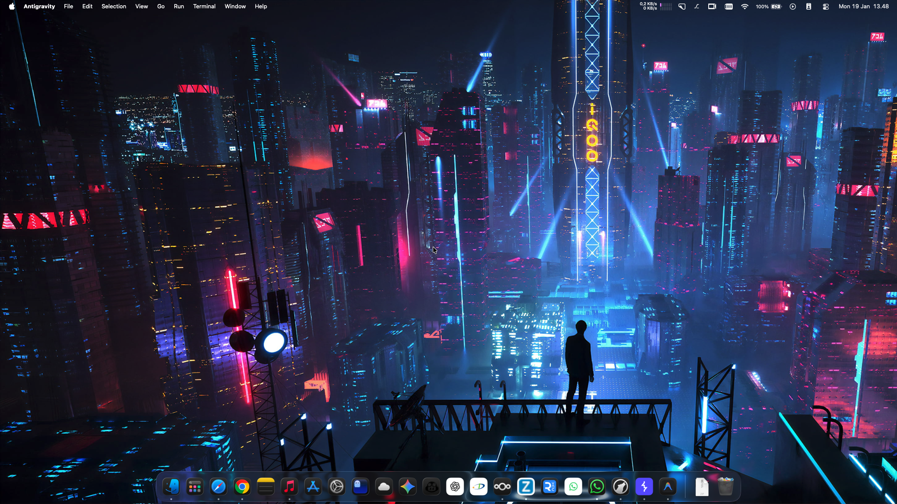
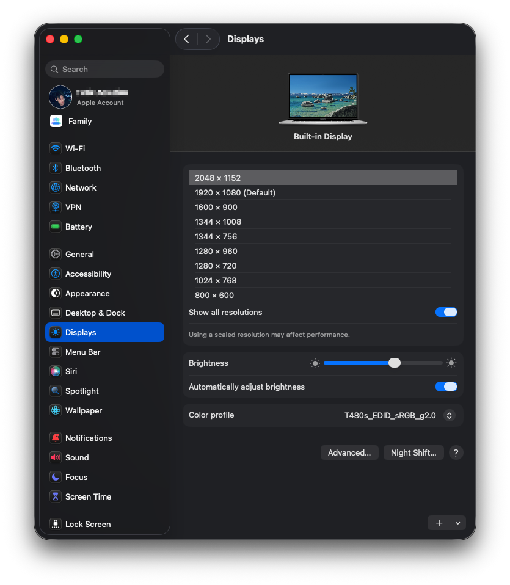
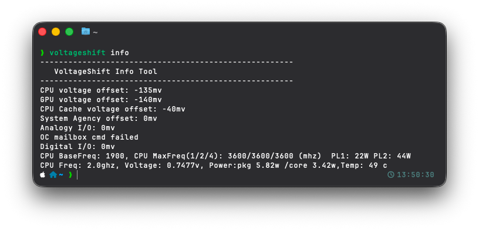
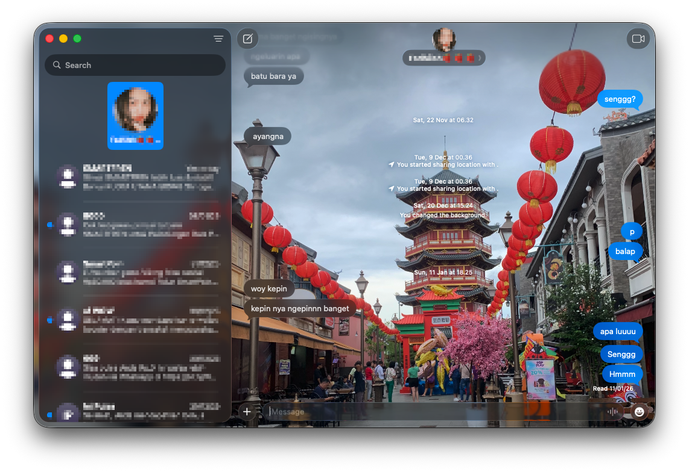
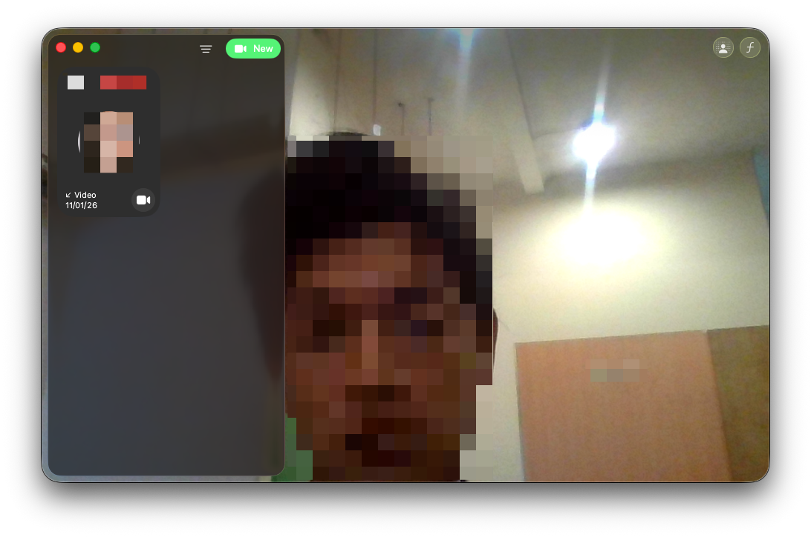
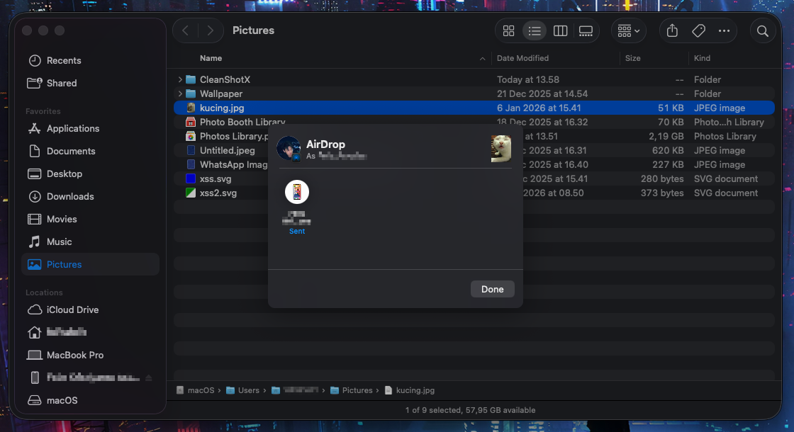

# <div align="center"> Hackintosh ThinkPad T480s </div>

<p align="center">
<a href="https://github.com/acidanthera/OpenCorePkg/releases/tag/1.0.6">

</a>

<a href="https://github.com/felikafelix/Hackintosh-Thinkpad-T480s/releases">

</a>
</p>

<p align="center">
<a href="https://github.com/felikafelix/Hackintosh-Thinkpad-T480s/tree/master">

</a>
<a href="https://github.com/felikafelix/Hackintosh-Thinkpad-T480s/tree/master">

</a>
<a href="https://github.com/felikafelix/Hackintosh-Thinkpad-T480s/tree/master">

</a>
</p>

<p align="center">
<b>OpenCore EFI for Lenovo ThinkPad T480s (i5-8350U, Intel UHD 620) with Touchscreen</b>
</p>

<p align="center">

</p>

---

## 📢 Notice

> **Tahoe Update**: I've upgraded to macOS Tahoe. EFI v5 is my last Sequoia release. If staying on Sequoia, consider switching SMBIOS to `MacBookPro16,3` for better power/performance management.

---

## 🚀 Quick Start

### 1. Download EFI
Get the latest EFI from **[Releases](../../releases)**

### 2. Generate SMBIOS
Use [GenSMBIOS](https://github.com/corpnewt/GenSMBIOS):
- **Ventura/Sequoia**: `MacBookPro16,3`
- **Tahoe**: `MacBookPro16,4`

Open `config.plist` with [ProperTree](https://github.com/corpnewt/ProperTree) and fill in:
| Key | Value |
|-----|-------|
| `PlatformInfo > Generic > SystemSerialNumber` | Serial |
| `PlatformInfo > Generic > MLB` | Board Serial |
| `PlatformInfo > Generic > SystemUUID` | SmUUID |

### 3. Configure BIOS
See [BIOS Settings](#-bios-settings) section below.

### 4. Install macOS

<details>
<summary><b>Ventura / Sequoia (OTA Upgrade)</b></summary>

1. Copy EFI to USB drive
2. Boot and install macOS
3. After install, copy EFI to internal drive's EFI partition

</details>

<details>
<summary><b>Tahoe (Clean Install via Recovery)</b></summary>

1. Download recovery image:
```bash
python3 ./macrecovery.py -b Mac-CFF7D910A743CAAF -m 00000000000000000 -os latest download
```
2. Copy `com.apple.recovery.boot` folder to USB alongside EFI
3. Boot to recovery and install (takes ~2 hours depending on network and disk speed)

</details>

### 5. Post-Install
See **[Post-Install Guide](docs/post-install.md)** for:
- Undervolting setup
- Display scaling (HiDPI / BetterDisplay)
- YogaSMC for Fn keys
- WiFi patching (AirportItlwm or itlwm)
- Airdrop/Continuity fix for itlwm users
- Etc...

**Need help?** Open an [Issue](../../issues)

---

## 💻 Device Specification

| Component | Details |
|----------:|:--------|
| **Model** | Lenovo ThinkPad T480s |
| **CPU** | Intel Core i5-8350U (4C/8T, 1.9GHz, Turbo 3.6GHz) |
| **iGPU** | Intel UHD Graphics 620 |
| **RAM** | 2×8GB DDR4 2400MHz |
| **SSD** | SanDisk X400 M.2 2280 256GB |
| **Display** | eDP 14" FHD 1920×1080 with Touchscreen |
| **Audio** | Realtek ALC257 |
| **Ethernet** | Intel I219-LM |
| **WiFi/BT** | Intel Wireless-AC 8265/8275 |
| **Camera** | 720p HD |
| **Trackpad** | Synaptics Precision (PS2/SMBus) |

---

## 🪛 BIOS Settings

| Menu Path | Setting |
|:----------|--------:|
| Config > USB > Always On USB | **Disabled** |
| Config > Keyboard/Mouse > Trackpoint | **Enabled** |
| Config > Keyboard/Mouse > Trackpad | **Enabled** |
| Config > Keyboard/Mouse > Fn and Ctrl Key swap | **Disabled** |
| Config > Keyboard/Mouse > Fn Sticky Key | **Disabled** |
| Config > Keyboard/Mouse > F1-F12 as Primary Function | **Disabled** |
| Config > Display > Boot Display Device | **Thinkpad LCD** |
| Config > Display > Shared Display Priority | **USB Type-C** |
| Config > Display > Total Graphics Memory | **512MB** |
| Config > Power > Intel SpeedStep Technology | **Enabled** |
| Config > CPU > Intel Hyper-Threading Technology | **Enabled** |
| Config > Thunderbolt 3 > Thunderbolt BIOS Assist Mode | **Enabled** |
| Config > Thunderbolt 3 > Security Level | **No Security** |
| Config > Thunderbolt 3 > Wake by Thunderbolt 3 | **Enabled** |
| Config > Thunderbolt 3 > Support in Pre Boot Environment | **Enabled** |
| Security > Security Chip | **Disabled** |
| Security > Memory Protection > Execution Prevention | **Enabled** |
| Security > Virtualization > Intel VT | **Enabled** |
| Security > Virtualization > Intel VT-d | **Enabled** |
| Security > I/O Port Access > Fingerprint Reader | **Disabled** |
| Security > Secure Boot | **Disabled** |
| Security > Intel SGX | **Software Controlled** |
| Security > Device Guard | **Disabled** |
| Boot > UEFI/Legacy Boot | **Both** |
| Boot > UEFI/Legacy Boot Priority | **Legacy First** |
| Boot > CSM Support | **Yes** |

---

## 📊 Status

<details>
<summary><b>✅ Working</b></summary>

| Feature | Notes |
|---------|-------|
| QE/CI & Hardware Acceleration | IQSV fully supported |
| Battery Management | Accurate percentage |
| CPU Power Management | Performance optimized |
| USB-A & USB-C | Including power delivery |
| HDMI Output | Video & audio |
| Audio | Speaker, internal mic, 3.5mm jack |
| WiFi 5GHz & 2.4GHz | Supported with Airdrop, Continuity, etc. |
| Bluetooth | Fully functional |
| Ethernet | Intel I219-LM |
| Trackpad & Trackpoint | Full gesture support |
| Touchscreen | Same as Trackpad, multi-gesture support |
| Keyboard & Backlight | All keys working |
| Internal Webcam | 720p HD |
| Sleep/Wake | Stable |
| ThinkPad Fn Keys | F1-F12 via YogaSMC |
| iServices | iMessage, FaceTime, App Store, Find My |
| Apple Music | Lossless/Hi-Res supported |
| Airdrop | Send to iPhone only |
| Continuity/Handoff | Universal Clipboard, etc. |
| iPhone Camera | USB cable |
| Android USB Tethering | HoRNDIS included |

</details>

<details>
<summary><b>❌ Not Working</b></summary>

| Feature | Reason |
|---------|--------|
| Safari DRM / Apple TV+ | Requires dGPU (workaround: Chrome/Firefox with Widevine) |
| Fingerprint Reader | No macOS driver |
| Airdrop Receiver | Intel WiFi limitation |
| iPhone Camera (Wireless) | Requires native AirDrop |

</details>

<details>
<summary><b>🔍 Not Tested</b></summary>

- Thunderbolt 3 (no device to test)
- Card Reader (no memory card)
- WWAN (no card installed)

</details>

<details>
<summary><b>🐛 Known Issues</b></summary>

**Color Banding**
-  Inaccurate color gradients in subtle shades (skies, dark scenes, UI gradients). This is a T480s stock panel limitation. Workaround by spoofing to Skylake platform-id works only on Monterey and older.

**ELAN Microelectronics USB Touchscreen Variant Issue**
- For ELAN Microelectronics USB Touchscreen variant on Tahoe, the touchscreen works but causes issues with wake from sleep, restart, and shutdown.


</details>

---

## 🛠️ Useful Tools

| Tool | Description |
|------|-------------|
| [ProperTree](https://github.com/corpnewt/ProperTree) | Plist editor |
| [GenSMBIOS](https://github.com/corpnewt/GenSMBIOS) | Generate SMBIOS |
| [Hackintool](https://github.com/benbaker76/Hackintool) | System info & patches |
| [OCAuxiliaryTools](https://github.com/ic005k/OCAuxiliaryTools) | OpenCore config editor |
| [MaciASL](https://github.com/acidanthera/MaciASL) | ACPI editor |
| [YogaSMC](https://github.com/zhen-zen/YogaSMC) | ThinkPad Fn keys |
| [VoltageShift](https://github.com/sicreative/VoltageShift) | Undervolting |
| [BetterDisplay](https://github.com/waydabber/BetterDisplay) | HiDPI & custom resolution |
| [HiDPI](https://github.com/xzhih/one-key-hidpi) | One-key HiDPI script |
| [MyKextInstaller](https://github.com/Mirone/MyKextInstaller) | Kext installer (Tahoe audio) |
| [Python3](https://www.python.org/downloads/macos/) | For scripts |
| [Homebrew](https://brew.sh/) | Package manager |

---

## 📚 Documentation

| Guide | Description |
|-------|-------------|
| **[Post-Install Guide](docs/post-install.md)** | Undervolting, WiFi, Display, YogaSMC, Airdrop fix, etc |
| **[Ventura Notes](docs/macos-versions/ventura.md)** | Version-specific notes |
| **[Sequoia Notes](docs/macos-versions/sequoia.md)** | Version-specific notes |
| **[Tahoe Notes](docs/macos-versions/tahoe.md)** | Version-specific notes + clean install |

---

## 📸 Screenshots

<details>
<summary><b>Click to expand gallery</b></summary>

### Desktop
<p align="center"></p>

### System & Graphics Info (VDA Decoder Fully Supported)
<p align="center"></p>

### Display (BetterDisplay Upscale)
<p align="center"></p>

### Apple Music Lossless
<p align="center"></p>

### Screen Mirroring
<p align="center"></p>

### AirPlay
<p align="center"></p>

### Intel Power Gadget
<p align="center"></p>

### Hardware Acceleration (ffmpeg)
<p align="center"></p>

### Undervolting (VoltageShift)
<p align="center"></p>

### YogaSMC
<p align="center"></p>

### WiFi
<p align="center"></p>

### Bluetooth
<p align="center"></p>

### iMessage
<p align="center"></p>

### FaceTime
<p align="center"></p>

### App Store
<p align="center"></p>

### AirDrop
<p align="center"></p>

</details>

---

## 🙏 Credits & Acknowledgements

**Contributors:**
- [@aerhazu](https://github.com/aerhazu) - Thunderbolt improvements

**Projects & Tools:**
| Project | Maintainer |
|---------|------------|
| [OpenCore](https://github.com/acidanthera/OpenCorePkg), [Lilu](https://github.com/acidanthera/Lilu), [AppleALC](https://github.com/acidanthera/AppleALC), [WhateverGreen](https://github.com/acidanthera/WhateverGreen) | [Acidanthera](https://github.com/acidanthera) |
| [itlwm](https://github.com/OpenIntelWireless/itlwm), [HeliPort](https://github.com/OpenIntelWireless/HeliPort), [IntelBluetoothFirmware](https://github.com/OpenIntelWireless/IntelBluetoothFirmware) | [OpenIntelWireless](https://github.com/OpenIntelWireless) |
| [OpenCore Legacy Patcher](https://github.com/dortania/OpenCore-Legacy-Patcher) | [Dortania](https://github.com/dortania) |
| [OCLP-Mod](https://github.com/laobamac/OCLP-Mod) (Tahoe) | [laobamac](https://github.com/laobamac) |
| [VoltageShift](https://github.com/sicreative/VoltageShift) | [sicreative](https://github.com/sicreative) |
| [YogaSMC](https://github.com/zhen-zen/YogaSMC) | [zhen-zen](https://github.com/zhen-zen) |
| [ProperTree](https://github.com/corpnewt/ProperTree), [GenSMBIOS](https://github.com/corpnewt/GenSMBIOS), [CPUFriendFriend](https://github.com/corpnewt/CPUFriendFriend) | [corpnewt](https://github.com/corpnewt) |
| [Hackintool](https://github.com/benbaker76/Hackintool) | [benbaker76](https://github.com/benbaker76) |
| [BetterDisplay](https://github.com/waydabber/BetterDisplay) | [waydabber](https://github.com/waydabber) |
| [MyKextInstaller](https://github.com/Mirone/MyKextInstaller) | [Mirone](https://github.com/Mirone) |
| [HiDPI](https://github.com/xzhih/one-key-hidpi) | [xzhih](https://github.com/xzhih) |
| [HoRNDIS](https://github.com/TomHeaven/HoRNDIS) | [TomHeaven](https://github.com/TomHeaven) |
| [OCAuxiliaryTools](https://github.com/ic005k/OCAuxiliaryTools) | [ic005k](https://github.com/ic005k) |

---

## 📜 License

This repository is licensed under the [MIT License](./LICENSE)

OpenCore is licensed under the [BSD 3-Clause License](https://github.com/acidanthera/OpenCorePkg/blob/master/LICENSE.txt)

