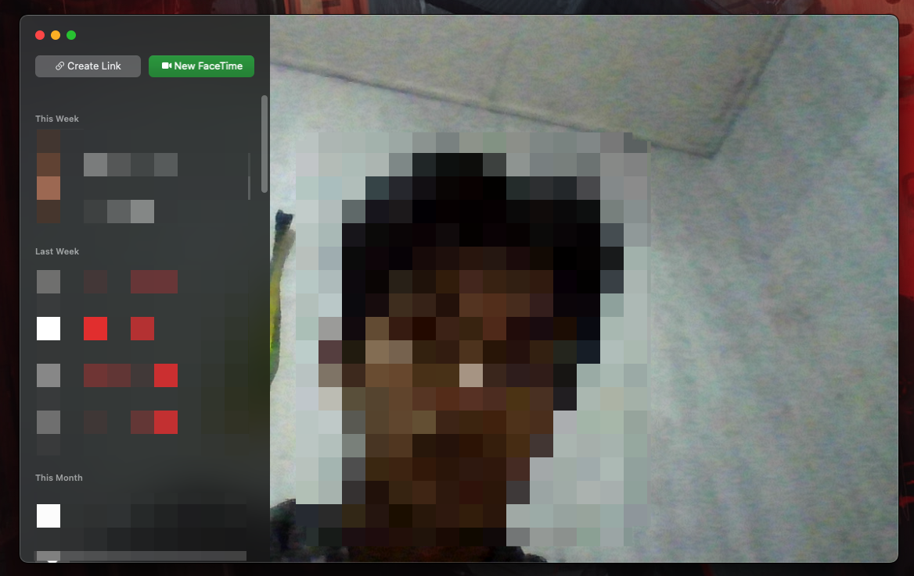

# 
 Hackintosh-Thinkpad-T480s 

OpenCore EFI for Lenovo ThinkPad T480s (i5-8350U, Intel UHD 620)

## Description

This EFI is created and tested for Lenovo Thinkpad T480s with Intel UHD 620. The configuration is optimized for smooth user experience, stable enough for daily usage, and hardware acceleration support.

---

## ‼️ Attention

- ✅ Please re-generate SMBIOS and insert it into config.plist before first boot.
- ✅ Apply undervolting using VoltageShift for better thermals and battery life (see notes section).
- ✅ Install YogaSMC app to enable all Fn keys functionality.
- ✅ Always keep a backup of your EFI before making changes (recommended: test changes on a USB).
- ✅ If boot fails or experiencing black screen on boot, try disabling EDID injection or set your own EDID in DeviceProperties.

## 🚀 Quick Start

1. **Download:** Get the latest EFI from [Releases](../../releases)
2. **Generate SMBIOS:** Use [GenSMBIOS](https://github.com/corpnewt/GenSMBIOS) with `MacBookPro15,2`
3. **Configure BIOS:** Follow settings in [BIOS Settings](#-bios-settings) section
4. **Install:** Copy EFI to your USB/Drive and boot
5. **Post-Install:** Install [YogaSMC](https://github.com/zhen-zen/YogaSMC) and setup [Undervolting](#Undervolting)

**Need help?** Open an [Issue](../../issues)

## 💻 Device Specification

### Model : Lenovo Thinkpad T480s

| Category | Component |
| --------: | :--------- |
| CPU | Intel Core i5-8350U (Quad-Core, 1.9GHz, Turbo up to 3.6GHz, Hyper-Threading) |
| iGPU | Intel UHD Graphics 620 |
| RAM | 2x8GB DDR4 2400MHz |
| SSD | SanDisk X400 M.2 2280 256GB |
| Display | 14-inch Full HD (1920x1080) with Touchscreen |
| Audio | Realtek ALC257 |
| Ethernet | Intel I219-LM |
| WiFi & BT | Intel Wireless-AC 8265/8275 |
| USB Controller | Sunrise Point-LP USB 3.0 xHCI |
| Camera | 720p HD Camera|
| Trackpad | Synaptics Precision Trackpad (via Voodoo PS2/SMBus) |
| macOS | 13.7.8 Ventura |
| OpenCore Version | 0.9.5 |

## 🪛 BIOS Settings

| Menu Path | Setting
| :--------- | -------: |
| Config > USB > Always On USB | Disabled |
| Config > Keyboard/Mouse > Trackpoint | Enabled |
| Config > Keyboard/Mouse > Trackpad | Enabled |
| Config > Keyboard/Mouse > Fn and Ctrl Key swap | Disabled |
| Config > Keyboard/Mouse > Fn Sticky Key | Disabled |
| Config > Keyboard/Mouse > F1-F12 as Primary Function | Disabled |
| Config > Display > Boot Display Device | Thinkpad LCD |
| Config > Display > Shared Display Priority | USB Type-C |
| Config > Display > Total Graphics Memory | 512MB |
| Config > Power > Intel (R) SpeedStep tecnology | Enabled |
| Config > CPU > Intel(R) Hyper-Threading Technology | Enabled |
| Config > Thunderbolt (TM) 3 > Thunderbolt BIOS Assist Mode | Enabled |
| Config > Thunderbolt (TM) 3 > Security Level | No Security |
| Config > Thunderbolt (TM) 3 > Wake by Thunderbolt (TM) 3 | Enabled |
| Config > Thunderbolt (TM) 3 > Support in Pre Boot Environment TB Device | Enabled |
| Security > Security Chip | Disabled |
| Security > Memory Protection > Execution Prevention | Enabled |
| Security > Virtualization > Intel (R) Virtualization Technology | Enabled |
| Security > Virtualization > Intel (R) VT-d Feature | Enabled |
| Security > I/O Port Access > Fingerprint Reader | Disabled |
| Security > Secure Boot Configuration > Secure Boot > Disabled |
| Security > Intel (R) SGX > Intel (R) SGX Control | Software Controlled |
| Security > Device Guard > Device Guard | Disabled |
| Boot > UEFI/Legacy Boot | Both |
| Boot > UEFI/Legacy Boot > UEFI/Legacy Boot Priority | Legacy First |
| Boot > UEFI/Legacy Boot > CSM Support | Yes |

## Status

 ✅ What's working 

  
- QE/CI
- Hardware Acceleration & IQSV
- Battery Percentage
- CPU Power Management / Performance
- USB A & USB C (including power delivery)
- Output HDMI (video & audio)
- Audio (Internal Speaker & Jack Headphone 3.5mm)
- Internal Microphone
- WiFi 5GHz & 2.4GHz
- Bluetooth 
- Ethernet
- Touchscreen (Gesture same as trackpad)
- Trackpad with Multi-Gesture & Trackpoint
- Keyboard & Backlight
- Internal Audio + Mic
- Internal Webcam
- Sleep / Wake
- Power Management (undervolt)
- Thinkpad Assistant :
    - F1 (Mute Speaker)
    - F2 (Volume Decrease)
    - F3 (Volume Increase)
    - F4 (Mute Microphone)
    - F5 (Brightness Decrease)
    - F6 (Brightness Increase)
    - F7 (Second Display)
    - F8 (Toggle WiFi)
    - F9 (Preferences)
    - F10 (Toggle Bluetooth)
    - F11 (Toggle Keyboard)
    - F12 (Toggle Launchpad)
- Apple Services (iMessage, Facetime, App Store, Find My, Continuity, etc)
- Apple Music Lossless (Hi-Res Audio)
  

 ❌ What's not working 

  
- Safari DRM & Apple TV+ (Blank / Audio Only, need eGPU or spoof SMBios to iMacPro1,1 / MacPro1,1. Workaround: Use browsers like chrome or firefox which use software-based DRM => widevine)
- Fingerprint Reader
- Airdrop ( Use DW / BCM Network Card to get it work )
  

🔍 Not tested 

  
- Thunderbolt 3 (I don't have TB3 device, but the power delivery is still working)
- WWAN (i don't have wwan card)
- Card Reader (i don't have memory card)
  

## Notes

- ### Undervolting
    - For thermal performance and better battery life, you can do undervolt to the CPU and GPU. i'm using <a href="https://github.com/sicreative/VoltageShift">Voltageshift</a> cli tool on macOS (the required kext is already included in this EFI).
    - The most stable offset i set is -125 (CPU), -130 (GPU), -50 (CPU Cache), you can set your own by running " voltageshift offset \<cpu\> \<gpu\> \<cpu cache\>
    - Example : 
    ``
    voltageshift offset -125 -130 -50 
    ``
    - Remember to set the offset carefully
    - After setting up the undervolting, always do the stress test to make sure there's no bug, screen flickering, or other issues. if no issue occurs, you can try to apply more aggresive offset.
    - For stresstest, i just open browser as much as i can, also play 4k video
    - Also use benchmark tools to test the offset stability
    - If the laptop crash / freeze, just force restart. the value will revert to default (0 0 0)
    - After make sure the offset is stable, just setup voltageshift with the launchagent to apply the offset every boot / wake from sleep

- ### Generate SMBios
    - Download and use <a href="https://github.com/corpnewt/GenSMBIOS">GenSMBios</a>
    - Choose Option ``3. Generate SMBios``
    - For model, you can use ``MacBookPro15,2`` or ``MacBookPro14,1``
    - Notes the output of GenSMBios (Serial, Board Serial / MLB, SmUUID, etc)
    - Edit the config.plist using <a href="https://github.com/corpnewt/ProperTree">ProperTree</a>
    - Paste the Serial, MLB, SmUUID, etc, to the ``PlatformInfo > Generic``

- ### Use Yoga SMC App
    - To Get all the Fn keys to work, use the <a href="https://github.com/zhen-zen/YogaSMC">YogaSMC app</a>
    - There's 2 option, YogaSMCNC or YogaSMCPane, the easiest is YOGASMCNC, but if you want more customized, use YogaSMCPane (must compile first)
    - YogaSMC App also can help to manage the fan

- ### Other Tools you might need
    - <a href="https://github.com/corpnewt/ProperTree">ProperTree</a>
    - <a href="https://github.com/benbaker76/Hackintool">Hackintool</a>
    - <a href="https://github.com/ic005k/OCAuxiliaryTools">OpenCore Auxiliary Tools (OCAT)</a>
    - <a href="https://github.com/acidanthera/MaciASL">MaciASL</a>
    - <a href="https://www.python.org/downloads/macos/">Python3</a>
    - <a href="https://brew.sh/">Homebrew</a>

## 📊 Performance

*Benchmarks with -125/-130/-50 undervolt settings*
 
*Room temperature, charger connected*

    

        Geekbench 6.4.0
    

| Test | Score |
| ----: | :------: |
| CPU (Single-Core)  | 901 |
| CPU (Multi-Core) | 2925 |
| GPU (Metal) | 5391 |
| GPU (OpenCL) | 3877 |

    

        Unigine Heaven 4.0 Basic Edition
    

| Test | Score |
| ----: | :-----: |
| Preset | Basic (OpenGL) |
| FPS | 18.7 |
| Score | 470 |
| Min. FPS | 7.2 |
| Max FPS | 41.3 |

    

        Cinebench R23
    

| Test | Score |
| ----: | :-----: |
| CPU (Multi-Core) | 3312 |
| CPU (Single-Core) | 674 |
| MP Ratio | 4.91x |

## Screenshot

- ### Desktop

    

- ### About This Mac

    

- ### System & Graphic Info (VDA Decoder Fully Supported)

    

- ### Display

    

- ### Apple Music Lossless Audio

    

- ### Intel Power Gadget (Resource while Browsing)

    

- ### Hardware Acceleration Check using ffmpeg

    

- ### Undervolt Using Voltageshift

    

- ### Yoga SMC App

    

- ### WiFi

    

- ### Bluetooth

    

- ### iMessage

    

- ### FaceTime

    

- ### App Store

    

## 📜 License

This repo is licensed under the <a href="./LICENSE">MIT License</a>

OpenCore is licensed under the <a href="https://github.com/acidanthera/OpenCorePkg/blob/master/LICENSE.txt">BSD 3-Clause License</a>
