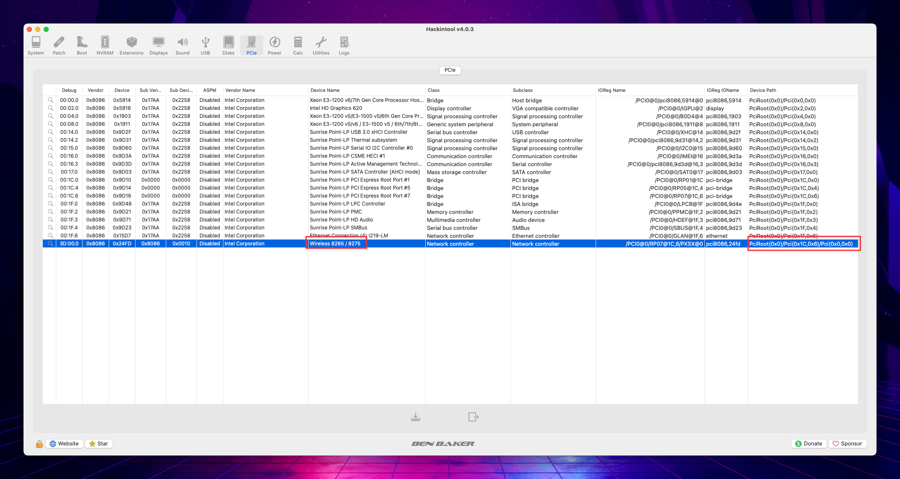
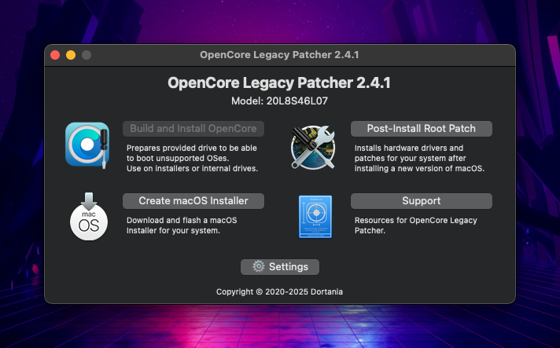
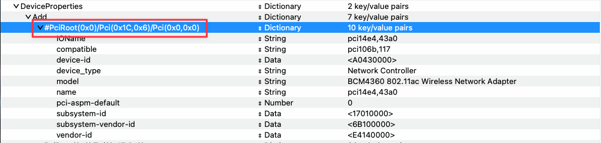
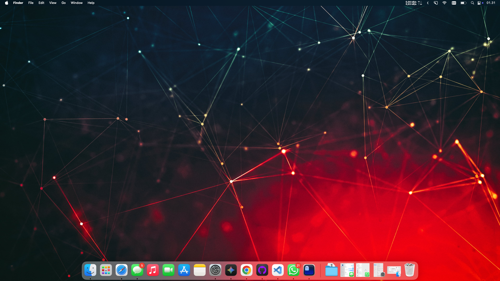
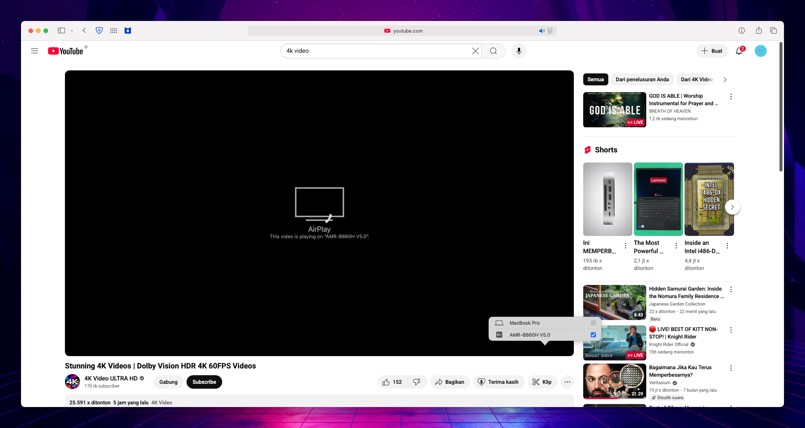
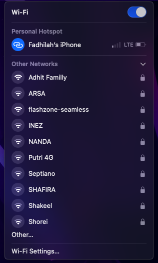
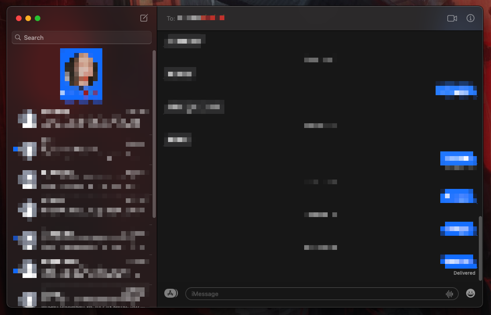

# 
 Hackintosh-Thinkpad-T480s 

## 🚀 Usage

see [README](../README.md)

**Need help?** Open an [Issue](https://github.com/felikafelix/Hackintosh-Thinkpad-T480s/issues)

##  📶 Wireless

on Sequoia, there's 2 option for WiFi to works

- Using Airportltlwm.kext + OCLP patch
- Using itlwm.kext + heliport app

A. Using airportltlwm.kext + OCLP patch

Prerequisites: 
* [Hackintool](https://github.com/benbaker76/Hackintool/releases)
* [OpenCore Legacy Patcher](https://github.com/dortania/OpenCore-Legacy-Patcher/releases)
* [ProperTree](https://github.com/corpnewt/ProperTree)
* [IO80211FamilyLegacy.kext](https://github.com/dortania/OpenCore-Legacy-Patcher/blob/main/payloads/Kexts/Wifi/IO80211FamilyLegacy-v1.0.0.zip)
* [IOSkywalkFamily.kext](https://github.com/dortania/OpenCore-Legacy-Patcher/blob/main/payloads/Kexts/Wifi/IOSkywalkFamily-v1.2.0.zip)
* [AMFIPass.kext](https://github.com/dortania/OpenCore-Legacy-Patcher/blob/main/payloads/Kexts/Acidanthera/AMFIPass-v1.4.1-RELEASE.zip)
* [Airportltlwm.kext](https://github.com/openintelwireless/itlwm/releases) --> **Get the latest stable ventura kext!!!**

    ### Step 1 : Spoofing
    Open Hackintool and navigate to PCIe section. There you will find your Intel Wireless Card. Mine is listed as "Intel Corporation | Wireless 8265 / 8275 | Network Controller".
    Right Click it and select "Copy Device Path"

    

    
    

    Open your config.plist using ProperTree, navigate to Device Properties. Under `add`, add a new dictionary with the name of your network card's device path:

    | Key | Type | Value |
    |:---:|:----:|:-----:|
    |IOName|String|pci14e4,43a0|
    |compatible|String|pci106b,117|
    |device-id|Data|A0430000|
    |device_type|String|Network Controller|
    |model|String|BCM4360 802.11ac Wireless Network Adapter|
    |name|String|pci14e4,43a0|
    |pci-aspm-default|Number|0|
    |subsystem-id|Data|17010000|
    |subsystem-vendor-id|Data|6B100000|
    |vendor-id|Data|E4140000|

      

    It should look like this now:
    

    
    

    ---

    After that, it's time to add the kexts. Add the kexts to your EFI folder: `EFI > OC > Kexts > here`. In ProperTree, press "⌘ + r" to add them into config.plist.  
    Make sure to watch the order carefully. Here is the table
    |Number|Kext|
    |:----:|:--|
    |1|IOSkywalkFamily.kext|
    |2|IO80211FamilyLegacy.kext|
    |3|IO80211FamilyLegacykext/Contents/Plugins/AirPortBrcmNIC.kext|
    |4|AMFIPass.kext|
    |5|Airportltlwm.kext|
    

    > Make sure you don't have `amfi_get_out_of_my_way` or `amfi=0x80` in your boot-args.

    > Make sure you don't have itlwm.kext enabled. if you do, disable it or delete it completely.

     

    It should look like this now:
    

    
    

    
    ---

    Now, we need to block one of Apple's kexts from loading. 
    Go to `Kernel > Block` section and enable `Allow IOSkywalk Downgrade`.

    It should look like this now:
    

    
    

    ---

    For OCLP to work, you need to set `csr-active-config` (located under `NVRAM > 7C436110-AB2A-4BBB-A880-FE41995C9F82`) and set it to `03080000`.

    That should look like this:
    

    
    

    **Reboot!!**

    ---

    ### Step 2 : Patching
    Open OpenCore Legacy Patcher and select `Post-Install Root Patch`. It should now find the patch. Select `Start Root Patching`. After finishes, reboot
    

    
    

    > If you get any SIP related errors, try resetting NVRAM.

    ---

    Now, the native WiFi still won't work. to fix that, we will simply comment out the spoof. To do that, open your config.plist to `DeviceProperties > Add` again. Then, find your network card's device path and add a `#` in front of it.

    Now, it should say something like `#PciRoot(0x0)/Pci(0x1C,0x6)/Pci(0x0,0x0)`. This is just an example, yours will differ.
    

    
    

    After a reboot, WiFi should work flawlessly now. AirPlay and iServices should also work, even AirDrop, although AirDrop is one-way only.

    ---

    ### Step 3 : Bluetooth
    As you may have noticed, Bluetooth doesn't work anymore. Fortunately, there is a very easy fix. Go to `NVRAM > 7C436110-AB2A-4BBB-A880-FE41995C9F82` and create two new keys:

    |Key|Type|Value|
    |:-:|:--:|:----|
    |bluetoothExternalDongleFailed|Data|00|
    |bluetoothInternalControllerInfo|Data|0000000000000000000000000000|

    That should look like this:

    

    
    

    If still not work, try resetting NVRAM multiple times.

    >DISCLAIMER: i didn't do the research. i only gathered information on the internet and include the tutorial on this repo. Thanks to [randomappleboi](https://github.com/randomappleboi)

B. Using itlwm.kext with heliport app

1. Disable all 5 kexts on the first method (airportltlwm.kext + oclp patch)
2. Disable `Allow IOSkywalk Downgrade` on `Kernel > Block` at config.plist
3. set `csr-active-config` on `NVRAM > Add > 7C436110-AB2A-4BBB-A880-FE41995C9F82` to `00000000`
4. Download and Install [HeliPort.dmg](https://openintelwireless.github.io/HeliPort/Installation.html) 
5. Run and add HeliPort.app to `Open at Login`

## 📸 Screenshot

- ### Desktop

    

- ### About This Mac

    

- ### System & Graphic Info (VDA Decoder Fully Supported)

    

- ### Display (HiDPI)

    

- ### Apple Music Lossless Audio

    

- ### Screen Mirroring

    

- ### AirPlay

    

- ### Intel Power Gadget
    - Resource on Idle
    - Some light background apps running

    

- ### Hardware Acceleration Check using ffmpeg

    

- ### Undervolt Using Voltageshift

    

- ### Yoga SMC App

    

- ### WiFi

    

- ### Bluetooth

    

- ### iMessage

    

- ### FaceTime

    

- ### App Store

    

## 📜 License

This repo is licensed under the <a href="./LICENSE">MIT License</a>

OpenCore is licensed under the <a href="https://github.com/acidanthera/OpenCorePkg/blob/master/LICENSE.txt">BSD 3-Clause License</a>
