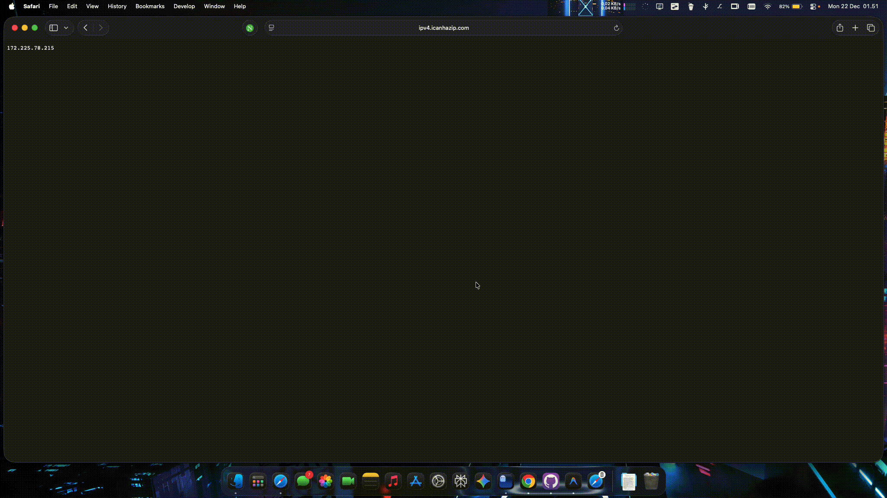
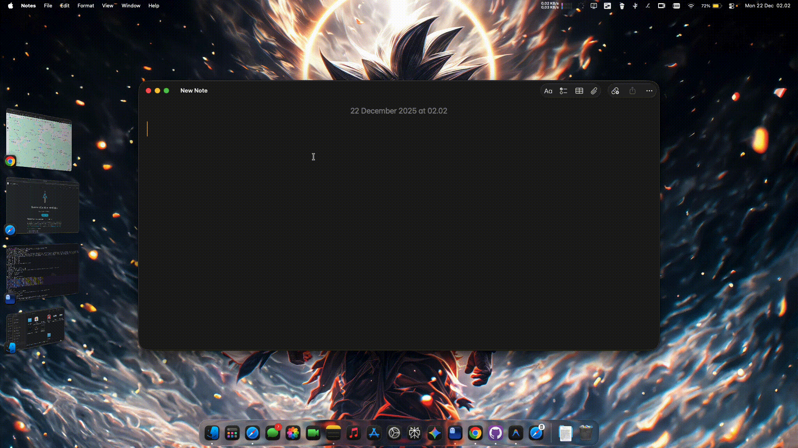
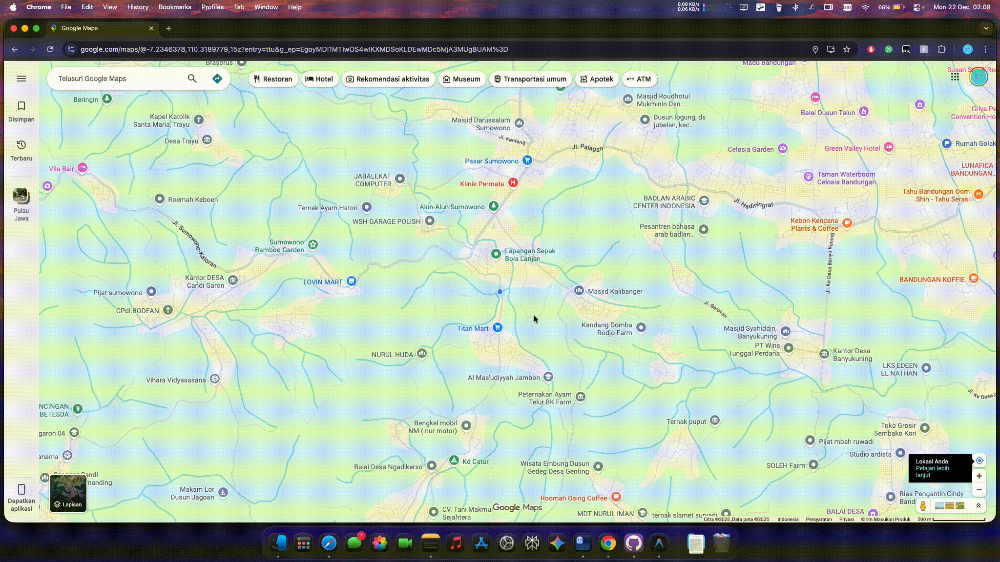

# Patch itlwm.kext + Heliport for ability to use Airdrop, Private Relay, Continuity Handoff, etc..

This is just temporary patch, based on macOS race condition, to be able to use Aidrop, Continuity Handoff, Private Relay, etc.. i'm not techy guy that learn much deep about hackintoshing, so i hope someone will create a better patch tool for this. Like just install and click patch, no need to do anything else.

# For you guys that want to reproduce this race condition, here is the steps i do:
1. On your hackintosh, make sure to use itlwm.kext + Heliport
2. run ```log stream --predicate 'subsystem contains "com.apple.networkserviceproxy" OR process == "NEHelper"' --info --style compact``` to monitor and watch the logs
3. Make sure private relay is active (the status would be Unavailable)
4. (Optional) Enable location services, handoff continuity, etc.
5. Install [Cloudflare WARP for MacOS](https://developers.cloudflare.com/cloudflare-one/team-and-resources/devices/warp/download-warp/)
6. After installation, on ```System Settings > General > Login Items & Extensions``` you will see 2 new items.

    - For ```Cloudflare Inc.```, make sure its enabled.
    - For ```Cloudflare WARP.app```, you can disabled it if you want.

<p align="center">
    
</p>

7. now, when the private relay is enabled, toggle of the ```Cloudflare Inc.``` login items, there will be a notification says ```Private Relay Active```
<p align="center">
    
</p>

---
#
#
#
---


# (For Common Users) Step by Step to temporary patch itlwm.kext + Heliport to use Private Relay, Airdrop, Continuity Handoff, etc..

1. Download and Install [Cloudflare WARP for MacOS](https://developers.cloudflare.com/cloudflare-one/team-and-resources/devices/warp/download-warp/)
2. Go to ```System Settings```, and set Private Relay to ```On``` it will shows that private relay is unavailable, 
(Optional) you can set ```Location Services```, ```Continuity Handoff```, etc to ```on also...

3. After the installation of Cloudflare WARP for MacOS, go to ```System Settings > General > Login Items & Extensions```, you will see 2 new items.

    - For ```Cloudflare Inc.```, make sure its enabled.
    - For ```Cloudflare WARP.app```, you can disabled it if you want.

<p align="center">
    
</p>

4. Create ```enable_privaterelay.sh``` file in /usr/local/bin using root to automate the process.
    
    Open Terminal and run this command:
    ```
    sudo su
    cd /usr/local/bin
    touch enable_privaterelay.sh
    chmod +x enable_privaterelay.sh
    ```

    Edit the ```enable_privaterelay.sh``` file with this content:
    ```
    #!/bin/bash

    # --- CONFIGURATION ---
    TARGET_USER="CHANGE_THIS_TO_YOUR_USERNAME"
    CF_PLIST="/Library/LaunchDaemons/com.cloudflare.1dot1dot1dot1.macos.warp.daemon.plist"
    CF_SERVICE="system/com.cloudflare.1dot1dot1dot1.macos.warp.daemon"

    # Log for monitoring
    log_msg() { echo "$(date): $1" >> /tmp/cf_automation.log; }

    log_msg "--- Script started ---"

    # 0. Wait for Desktop/Boot (Wait for Finder User Activated)
    while ! pgrep -u "$TARGET_USER" "Finder" > /dev/null; do
        sleep 2
    done

    # Wait 10 seconds after user got to desktop
    log_msg "Desktop active. Waiting for 10 seconds..."
    sleep 10

    # --- STEP 1: MAKE SURE CLOUDFLARE INC ENABLED ---
    # Check if Cloudflare Inc Login Item is enabled
    if launchctl list | grep -q "com.cloudflare.1dot1dot1dot1.macos.warp.daemon"; then
        log_msg "[OK] Cloudflare Inc already Enabled."
    else
        log_msg "[FIX] Cloudflare Inc Disabled. Enabling now..."
        launchctl bootstrap system "$CF_PLIST"
        sleep 2
    fi

    # --- STEP 2: MAKE SURE PRIVATE RELAY ON ---
    # Check Private Relay Status on or off
    PR_STATUS=$(sudo -u "$TARGET_USER" defaults read com.apple.NetworkServiceProxy NspEnabled 2>/dev/null)

    if [ "$PR_STATUS" == "1" ]; then
        log_msg "[OK] Private Relay already ON."
    else
        log_msg "[FIX] Private Relay OFF. Enabling now..."
        sudo -u "$TARGET_USER" defaults write com.apple.NetworkServiceProxy NspEnabled -bool true
        sleep 2
    fi

    # --- STEP 3: TOGGLE (DISABLE -> ENABLE) CLOUDFLARE INC ---
    # After making sure both are enabled, we will perform the toggle
    log_msg "[ACTION] Performing Toggle (Restart) Cloudflare Inc..."

    # A. Disable (Bootout)
    launchctl bootout "$CF_SERVICE" 2>/dev/null
    log_msg "-> Disabled/Bootout selesai."

    sleep 3 # Wait for network stack release

    # B. Enable (Bootstrap)
    launchctl bootstrap system "$CF_PLIST"
    # Kickstart optional to make sure daemon is awake
    launchctl kickstart -k "$CF_SERVICE" 2>/dev/null
    log_msg "-> Enabled/Bootstrap selesai."

    log_msg "--- Done ---"
    ```

    Edit the value of ```TARGET_USER``` to your username. You can see your user by running command:
    ```
    whoami
    ```
    Example after edited:
    ```
    TARGET_USER="felikafelix"
    ```
    After that, save and exit.

5. Before creating the automation job, make sure to test the script first.
    Open Terminal and run this command:
    ```
    sudo su
    /usr/local/bin/enable_privaterelay.sh
    ```
    If everything is working fine (like there is a notification says ```Private Relay Active```), you can proceed to the next step.

6. For creating the automation job (start script on system boot, and after wake from sleep), need to install slepwatcher
    ```
    brew install sleepwatcher
    ```

7. Create launch daemons root user
    ```
    sudo nano /Library/LaunchDaemons/de.bernhard-baehr.sleepwatcher.plist
    ```
    Edit the file with this content:
    ```
    <?xml version="1.0" encoding="UTF-8"?>
    <!DOCTYPE plist PUBLIC "-//Apple Computer//DTD PLIST 1.0//EN" "http://www.apple.com/DTDs/PropertyList-1.0.dtd">
    <plist version="1.0">
    <dict>
    <key>Label</key>
    <string>de.bernhard-baehr.sleepwatcher</string>
    
    <key>ProgramArguments</key>
    <array>
        <string>/bin/bash</string>
        <string>-c</string>
        <string>/usr/local/bin/enable_privaterelay.sh; /usr/local/sbin/sleepwatcher -V -w /usr/local/bin/enable_privaterelay.sh</string>
    </array>
    
    <key>RunAtLoad</key>
    <true/>
    <key>KeepAlive</key>
    <true/>
    </dict>
    </plist>
    ```
    After that, save and exit.

    Logic explanation:
    - when macOS booting, it will load this plist ```RunAtLoad: True```
    - ```/usr/local/bin/enable_privaterelay.sh``` will execute the cloudflare login item toggle.
    - ```;``` after first command done, continue to next command.
    - ```/usr/local/sbin/sleepwatcher ...``` run sleepwatcher daemon that will wait on wake from sleep event.

8. Start the service
    ```
    sudo launchctl bootstrap system /Library/LaunchDaemons/de.bernhard-baehr.sleepwatcher.plist
    ```


7. Reboot your system. The script will run automatically after boot and wake from sleep event,and you should be able to use Private Relay, Airdrop, Continuity Handoff, etc..

---

# Usage Testing
1. Private Relay
<p align="center">
    
</p>

2. Airdrop (Sent Only - iPhone to Mac)
<p align="center">
    
</p>

3. Handoff (iPhone to Mac)
<p align="center">
    
</p>

4. Universal Clipboard (iPhone to Mac)
<p align="center">
    
</p>

5. Location Services
issue: locations services can be turned on, but the location seems not correct
<p align="center">
    
</p>

6. Airplay Receiver
<p align="center">
    
</p>   