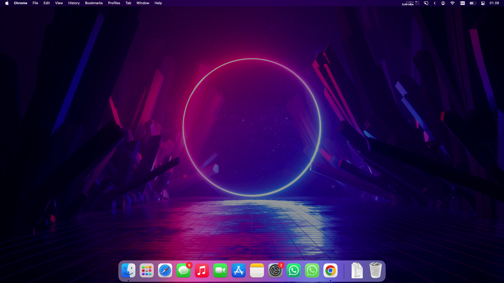
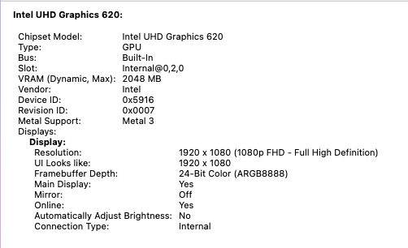
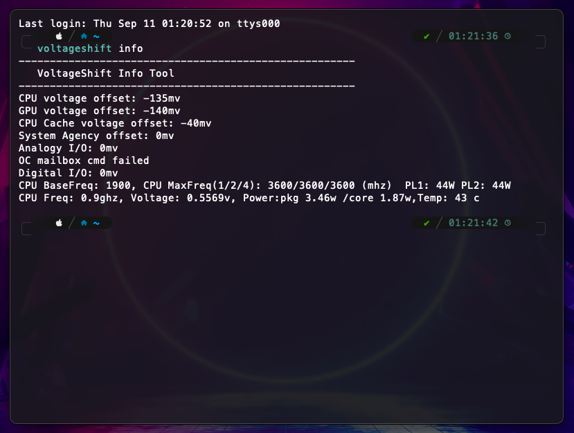
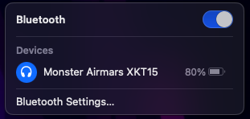
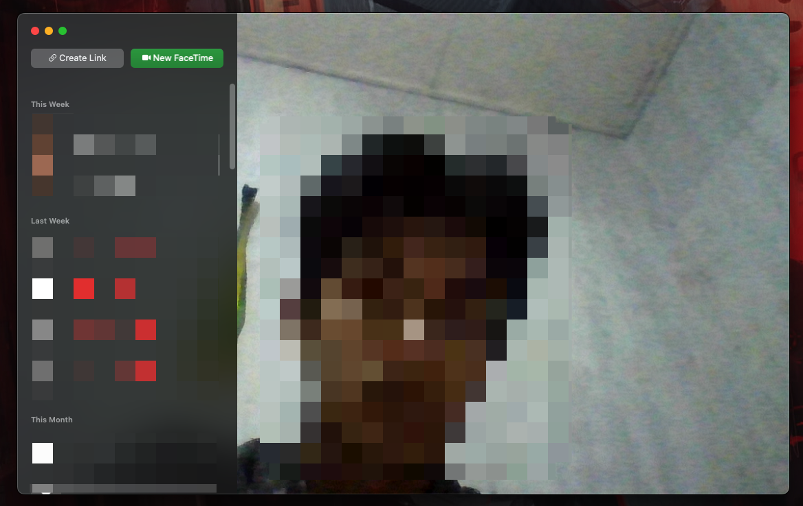

# 
 Hackintosh-Thinkpad-T480s 

## ⚠️ Attention

I just upgraded my hacks to Sequoia, so v3 will be my last update for Ventura.  In case you want to upgrade from ventura to sequoia, im using the v3 release to upgrade from Ventura to Sequoia using <b>System Settings > General > Software Update</b>.

The Adjustment i do on my EFI before upgrade

- Disable voltageshift script and its kext
- Cleaning the boot-args, add `-v` and `keepsyms=1`
-  Misc > Boot >
    - Show Picker = True
    - Timeout = 10
- Disable HiDPI
- After succesfully upgraded to sequoia, you can change the EFI to my sequoia release, and / or re-enable any kext & system patch disabled before upgrading.

if you still want to stay on Ventura, maybe consider changing smbios to 16,3. From what i test on my Sequoia, the power and performance management is better.

## 🚀 Usage

see [README](../README.md)

**Need help?** Open an [Issue](https://github.com/felikafelix/Hackintosh-Thinkpad-T480s/issues)

## 📌 Notes
i start adding HoRNDIS after installing Sequoia, so this Ventura EFI doesn't include the HoRNDIS yet (driver for android usb thetering), in case you need it:
1. Download [HoRNDIS](https://github.com/TomHeaven/HoRNDIS/releases) Kext
2. Add the kext to `EFI > OC > Kexts > here`,
3. Open config.plist with ProperTree, and do a snapshot `Command + R`, order the kext below airportltlwm or itlwm and save.
4. reboot

## 📸 Screenshot

- ### Desktop

    

- ### About This Mac

    

- ### System & Graphic Info (VDA Decoder Fully Supported)

    

- ### Display

    

- ### Apple Music Lossless Audio

    

- ### Intel Power Gadget
    - Resource on Idle
    - Some light background apps running

    

- ### Hardware Acceleration Check using ffmpeg

    

- ### Undervolt Using Voltageshift

    

- ### Yoga SMC App

    

- ### WiFi

    

- ### Bluetooth

    

- ### iMessage

    

- ### FaceTime

    

- ### App Store

    

## 📜 License

This repo is licensed under the <a href="./LICENSE">MIT License</a>

OpenCore is licensed under the <a href="https://github.com/acidanthera/OpenCorePkg/blob/master/LICENSE.txt">BSD 3-Clause License</a>
