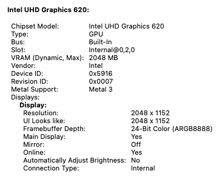

# macOS Sequoia Notes

---

## ⚠️ Notice

I've upgraded to Tahoe so **v5 is my last Sequoia release**.

If you want to stay on Sequoia, consider changing SMBIOS to `MacBookPro16,3` for better power/performance management.

---

## 📶 WiFi on Sequoia

On Sequoia, there are two options for WiFi:

### Option A: AirportItlwm + OCLP Patch
Full native-like WiFi experience with AirDrop support.

See [Post-Install Guide - Wireless Setup](../post-install.md#-wireless-setup)

### Option B: itlwm + Heliport
Simpler setup using Heliport app, location services with low accuracy.

See [Post-Install Guide - itlwm + Heliport](../post-install.md#option-b-itlwm--heliport)

---

## 🔄 Upgrading to Tahoe

Before upgrading from Sequoia to Tahoe:

1. **Disable VoltageShift** - Remove script and kext
2. **Clean boot-args** - Add `-v` and `keepsyms=1`
3. **BIOS settings**:
   - `Misc > Boot > Show Picker` = True
   - `Misc > Boot > Timeout` = 10
4. **Disable HiDPI/BetterDisplay**
5. **Upgrade** via clean install (see [Tahoe Notes](tahoe.md))
6. After upgrade, switch to Tahoe EFI and re-enable kexts/patches

---

## 📸 Screenshots

Click to expand

### Desktop

### About This Mac

### System & Graphics Info

### Display

---

[← Back to README](../../README.md)
