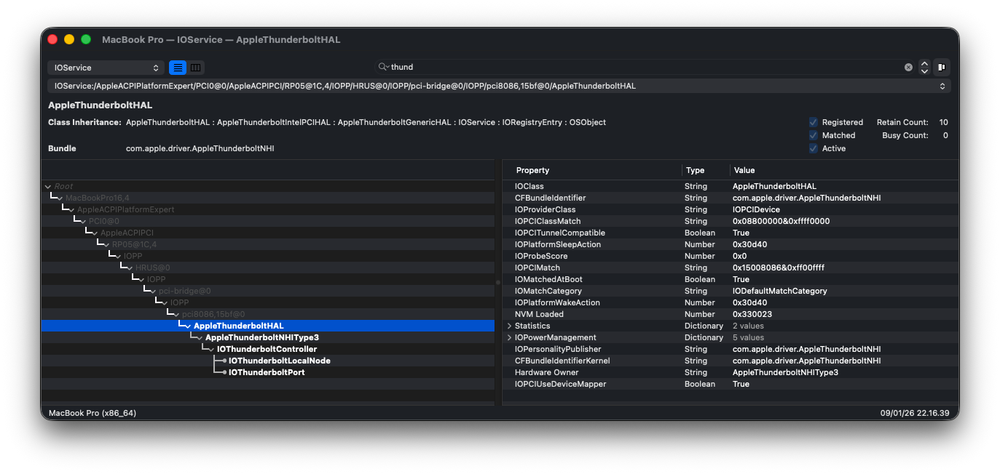

# macOS Tahoe Notes

<p align="center">


</p>

---

## 📝 Version Notes

### V9 Changes
- **Touchscreen support added** - I replaced my display with touchscreen panel
- **Thunderbolt improvements** - Now detected in IORegistryExplorer (thanks [@aerhazu](https://github.com/aerhazu))

<p align="center"></p>

**Tested on Thunderbolt port:**
- ✅ USB Flash Drive (USB to Type-C)
- ✅ External SSD (USB to Type-C)
- ✅ iPhone (Type-C to Lightning)

> If your Thunderbolt path differs from `RP05`, edit the path in TB3 SSDT and ACPI PATCH.

### V6 Changes
- Touchscreen kext removed (display without touchscreen)
- Use Sequoia EFI's touchscreen kext if needed

### V8+ SMBIOS Change
Changed from `MacBookPro16,1` to `MacBookPro16,4` for better performance and thermal management.

---

## 🛠️ Clean Installation

### Step 1: Prepare USB
1. Download [Tahoe Install EFI](https://github.com/felikafelix/Hackintosh-Thinkpad-T480s/releases/tag/v6.0.1)
   - Or create your own with [OpCore-Simplify](https://github.com/lzhoang2801/OpCore-Simplify)

2. Download recovery image:
```bash
python3 ./macrecovery.py -b Mac-CFF7D910A743CAAF -m 00000000000000000 -os latest download
```

3. Copy `com.apple.recovery.boot` folder to USB alongside EFI

### Step 2: Install
- Boot to recovery and install
- Installation takes ~2 hours depending on network
- Be patient!

### Step 3: Post-Install
1. Switch to [Latest Tahoe EFI](https://github.com/felikafelix/Hackintosh-Thinkpad-T480s/releases)
2. Generate SMBIOS with `MacBookPro16,4`
3. Setup CPUFriendDataProvider
4. Configure USB Mapping
5. Install audio with [MyKextInstaller](https://github.com/Mirone/MyKextInstaller)

See [Post-Install Guide](../post-install.md) for details.

---

## 📶 WiFi on Tahoe

On Tahoe, there are two options for WiFi:

### Option A: AirportItlwm + OCLP Patch
Full native-like WiFi experience with AirDrop support.

See [Post-Install Guide - Wireless Setup](../post-install.md#-wireless-setup)

### Option B: itlwm + Heliport
Simpler setup using Heliport app, location services with low accuracy.

See [Post-Install Guide - itlwm + Heliport](../post-install.md#option-b-itlwm--heliport)

---

## 🔊 Audio Fix

If audio is not working after installation:

### Using MyKextInstaller (Recommended)

1. Download [MyKextInstaller](https://github.com/Mirone/MyKextInstaller)
2. Open the app and click **Install**
3. Reboot your system
4. Audio should now work properly

### Manual Fix

If MyKextInstaller doesn't work:

1. Verify `AppleALC.kext` is loaded
2. Check `alcid` boot-arg matches your codec (default: `alcid=11`)
3. Try different layout IDs: `11`, `21`, `71`
4. Reset NVRAM and reboot

---

## ⚠️ FileVault Issue & Fix

If you're planning to change SMBIOS, you might need to disable FileVault first. If FileVault encryption progress is stuck:

### Symptoms
- `fdesetup status` shows encryption not progressing
- `diskutil apfs list` shows encryption paused

### Solution

1. Get your user UUID:
```bash
sudo fdesetup list
# Output: youruser, 12345678-1234-1234-1234-123456789012
```

2. Boot to Recovery Mode (OpenCore picker or hold `⌘+R`)

3. In Disk Utility: Mount your Data disk (greyed out)

4. Open Terminal from Utilities menu

5. Find your data partition:
```bash
diskutil apfs list
# Look for partition with "Encrypted" status
# Example: disk3s1
```

6. Start encryption daemon:
```bash
# For APFS:
/usr/libexec/apfsd

# For others:
/usr/libexec/corestoraged
```

7. Open new Terminal window, verify encryption is running:
```bash
diskutil apfs list
# "paused" status should be gone
```

8. Wait for encryption to complete

9. Decrypt volume:
```bash
diskutil apfs decryptVolume disk3s1 -user 12345678-1234-1234-1234-123456789012
```

10. After decrypt completes, reboot and change SMBIOS

---

## 📸 Screenshots

<details>
<summary>Click to expand</summary>

### Desktop
<p align="center"></p>

### About This Mac
<p align="center"></p>

### System & Graphics Info
<p align="center"></p>

### Display
<p align="center"></p>

</details>

---

[← Back to README](../../README.md)
