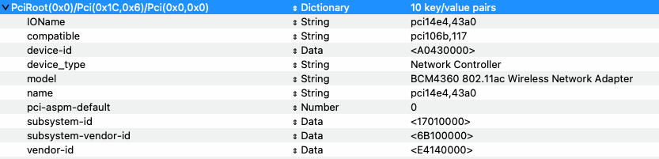
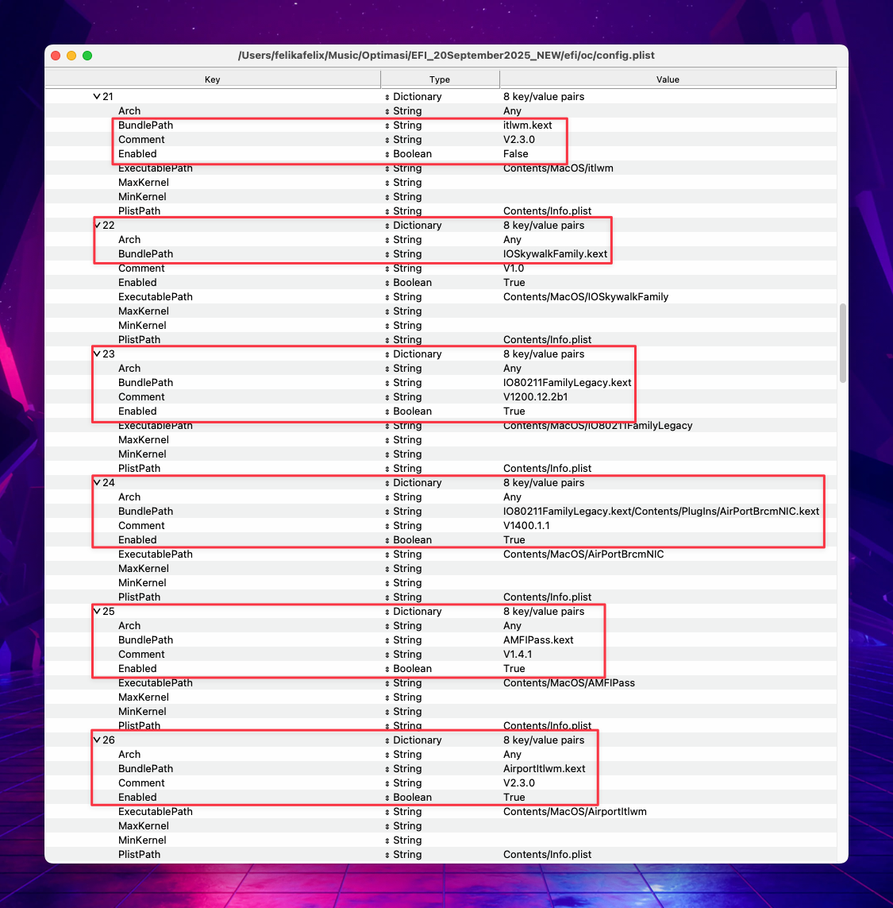
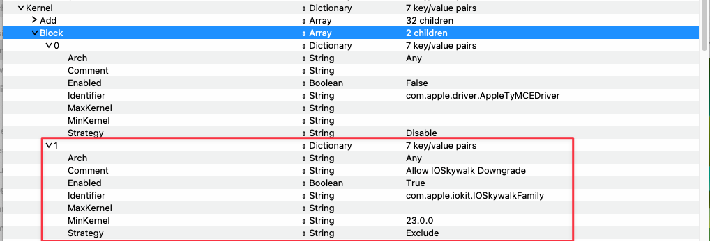
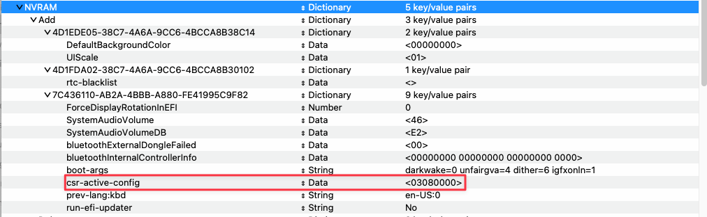
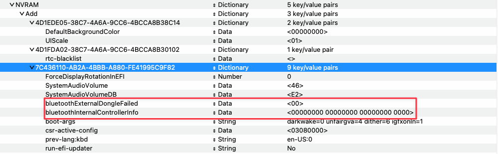
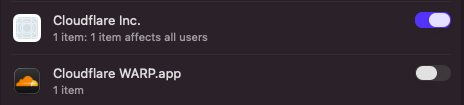
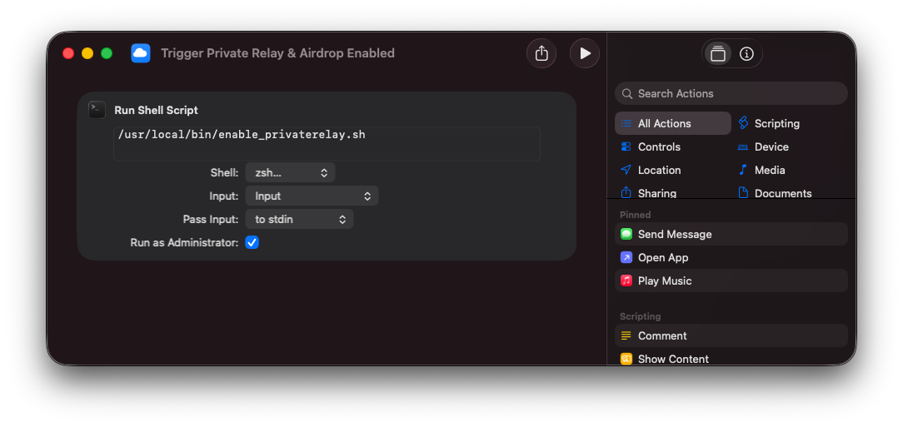
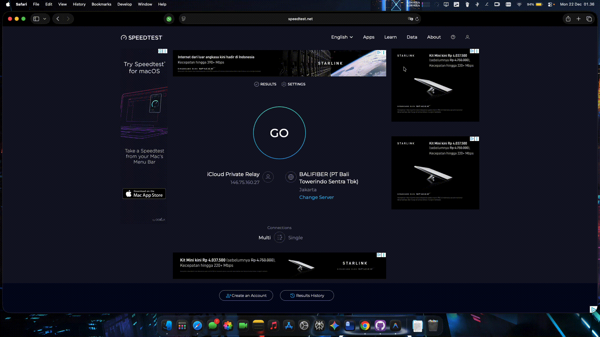
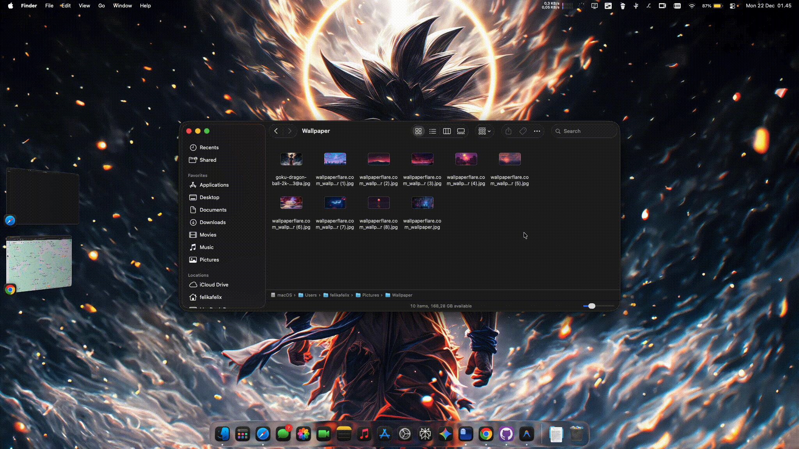

# Post-Install Guide

This guide covers all essential post-installation steps for your Hackintosh ThinkPad T480s.

---

## Table of Contents
- Undervolting
- Display Scaling
- YogaSMC Setup
- Audio Setup (Tahoe)
- USB Mapping]
- CPUFriendDataProvider
- Wireless Setup
  - Option A: AirportItlwm + OCLP Patch
  - Option B: itlwm + Heliport (Tested on Tahoe 26.2)
- Airdrop & Continuity Fix

---

## ⚡ Undervolting

For better thermal performance and battery life, use [VoltageShift](https://github.com/sicreative/VoltageShift). The required kext is already included in the EFI.

### Recommended Values
| Component | Offset |
|-----------|--------|
| CPU | -135 |
| GPU | -140 |
| CPU Cache | -40 |
| PL1 | 22W |
| PL2 | 44W |

### Manual Command
```bash
voltageshift offset -135 -140 -40 && voltageshift power 22 44
```

### Testing
After setting offsets, stress test your system:
- Open multiple browser tabs
- Play 4K video
- Run benchmark tools

If the laptop crashes/freezes, force restart. Values revert to default (0 0 0).

### Persistent Setup (LaunchAgent)

1. Create plist files:
```bash
touch ~/Library/LaunchAgents/{com.user.voltageshift.plist,com.user.voltageshift2.plist}
```

2. Edit `com.user.voltageshift.plist`:
```xml
<?xml version="1.0" encoding="UTF-8"?>
<!DOCTYPE plist PUBLIC "-//Apple//DTD PLIST 1.0//EN" "http://www.apple.com/DTDs/PropertyList-1.0.dtd">
<plist version="1.0">
<dict>
    <key>Label</key>
    <string>com.user.voltageshift</string>
    <key>ProgramArguments</key>
    <array>
        <string>/usr/local/bin/voltageshift</string>
        <string>offset</string>
        <string>-135</string>
        <string>-140</string>
        <string>-40</string>
        <string>0</string>
        <string>0</string>
        <string>0</string>
    </array>
    <key>RunAtLoad</key>
    <true/>
    <key>KeepAlive</key>
    <dict>
        <key>PathState</key>
        <dict>
            <key>/private/var/run/syslog</key>
            <true/>
        </dict>
    </dict>
</dict>
</plist>
```

3. Edit `com.user.voltageshift2.plist`:
```xml
<?xml version="1.0" encoding="UTF-8"?>
<!DOCTYPE plist PUBLIC "-//Apple//DTD PLIST 1.0//EN" "http://www.apple.com/DTDs/PropertyList-1.0.dtd">
<plist version="1.0">
<dict>
    <key>Label</key>
    <string>com.user.voltageshift2</string>
    <key>ProgramArguments</key>
    <array>
        <string>/usr/local/bin/voltageshift</string>
        <string>power</string>
        <string>22</string>
        <string>44</string>
    </array>
    <key>RunAtLoad</key>
    <true/>
    <key>KeepAlive</key>
    <dict>
        <key>PathState</key>
        <dict>
            <key>/private/var/run/syslog</key>
            <true/>
        </dict>
    </dict>
</dict>
</plist>
```

4. Load agents:
```bash
launchctl load ~/Library/LaunchAgents/com.user.voltageshift.plist
launchctl load ~/Library/LaunchAgents/com.user.voltageshift2.plist
```

To unload:
```bash
launchctl unload ~/Library/LaunchAgents/com.user.voltageshift.plist
launchctl unload ~/Library/LaunchAgents/com.user.voltageshift2.plist
```

---

## 🖥️ Display Scaling

Choose one option:

### Option 1: HiDPI Script
1. Download and run [HiDPI](https://github.com/xzhih/one-key-hidpi) script
2. Choose: `(2) Enable HiDPI (With EDID)` → `(3) MacBook Pro` → `(1) 1920x1080 Display`
3. Reboot

### Option 2: BetterDisplay (Recommended)
1. Install [BetterDisplay](https://github.com/waydabber/BetterDisplay)
2. Enable HiDPI mode
3. Set custom resolution as needed

---

## 🎛️ YogaSMC Setup

For full ThinkPad Fn key support:

1. Install [YogaSMC App](https://github.com/zhen-zen/YogaSMC)
2. The YogaSMCNC menu bar app helps manage:
   - Fan control
   - LED lights
   - Function keys

### Fn Key Functions
| Key | Function |
|-----|----------|
| F1 | Mute Speaker |
| F2/F3 | Volume Down/Up |
| F4 | Mute Microphone |
| F5/F6 | Brightness Down/Up |
| F7 | Second Display |
| F8 | Toggle WiFi* |
| F9 | Preferences |
| F10 | Toggle Bluetooth |
| F11 | Toggle Keyboard |
| F12 | Launchpad |

*F8 doesn't work with itlwm + Heliport

---

## 🔊 Audio Setup (Tahoe Only)

1. Ensure `AppleALC.kext` is in EFI with correct `layout-id`
2. Ensure `AMFIPass.kext` is enabled OR add `amfi=0x80` to boot-args
3. Download [MyKextInstaller](https://github.com/Mirone/MyKextInstaller/releases)
4. In MyKextInstaller: **Download KDKs** → Install
5. In MyKextInstaller: **Install Kexts** → Install `AppleHDA.kext`
6. Reboot

---

## 🔌 USB Mapping

Create your own USB map for optimal compatibility:
1. Use [USBToolBox](https://github.com/USBToolBox/tool)
2. Use [USBMap](https://github.com/corpnewt/USBMap)
3. Or use [Hackintool](https://github.com/benbaker76/Hackintool) USB section

---

## ⚙️ CPUFriendDataProvider

Generate a custom power profile:
1. Download [CPUFriendFriend](https://github.com/corpnewt/CPUFriendFriend)
2. Run and select preference:
   - Prioritize Power
   - Balanced Power
   - Balanced Performance
   - Prioritize Performance
3. Add generated kext to EFI

---

## 📶 Wireless Setup

On Sequoia and Tahoe, choose one option:

### Option A: AirportItlwm + OCLP Patch

> Works like native WiFi, supports iServices and AirDrop (one-way)

#### Prerequisites
- [Hackintool](https://github.com/benbaker76/Hackintool/releases)
- OpenCore Legacy Patcher: [Official](https://github.com/dortania/OpenCore-Legacy-Patcher/releases) (Sequoia) or [Modded](https://github.com/laobamac/OCLP-Mod) (Tahoe)
- [ProperTree](https://github.com/corpnewt/ProperTree)
- [IO80211FamilyLegacy.kext](https://github.com/dortania/OpenCore-Legacy-Patcher/blob/main/payloads/Kexts/Wifi/IO80211FamilyLegacy-v1.0.0.zip)
- [IOSkywalkFamily.kext](https://github.com/dortania/OpenCore-Legacy-Patcher/blob/main/payloads/Kexts/Wifi/IOSkywalkFamily-v1.2.0.zip)
- [AMFIPass.kext](https://github.com/dortania/OpenCore-Legacy-Patcher/blob/main/payloads/Kexts/Acidanthera/AMFIPass-v1.4.1-RELEASE.zip) (Sequoia) or `amfi=0x80` boot-arg (Tahoe)
- [AirportItlwm.kext](https://github.com/openintelwireless/itlwm/releases) - **Get Ventura version!**

#### Step 1: Spoofing

1. Open Hackintool → PCIe section
2. Find Intel Wireless Card, right-click → **Copy Device Path**

<p align="center"></p>

3. Open `config.plist` with ProperTree
4. Navigate to `DeviceProperties > Add`
5. Add new dictionary with your device path:

| Key | Type | Value |
|-----|------|-------|
| IOName | String | pci14e4,43a0 |
| compatible | String | pci106b,117 |
| device-id | Data | A0430000 |
| device_type | String | Network Controller |
| model | String | BCM4360 802.11ac Wireless Network Adapter |
| name | String | pci14e4,43a0 |
| pci-aspm-default | Number | 0 |
| subsystem-id | Data | 17010000 |
| subsystem-vendor-id | Data | 6B100000 |
| vendor-id | Data | E4140000 |

<p align="center"></p>

6. Add kexts to `EFI/OC/Kexts`, use ProperTree `⌘+R` to snapshot

**Kext Order:**
| # | Kext |
|---|------|
| 1 | IOSkywalkFamily.kext |
| 2 | IO80211FamilyLegacy.kext |
| 3 | IO80211FamilyLegacy.kext/Contents/Plugins/AirPortBrcmNIC.kext |
| 4 | AMFIPass.kext (Sequoia only) |
| 5 | AirportItlwm.kext |

<p align="center"></p>

7. Go to `Kernel > Block`, enable **Allow IOSkywalk Downgrade**

<p align="center"></p>

8. Set `NVRAM > 7C436110-AB2A-4BBB-A880-FE41995C9F82 > csr-active-config` to `03080000`

<p align="center"></p>

9. **Reboot**

#### Step 2: OCLP Patching

1. Open OpenCore Legacy Patcher
2. Select **Post-Install Root Patch**
3. Click **Start Root Patching**
4. After completion, reboot

<p align="center"></p>

> If SIP errors occur, try resetting NVRAM

#### Step 3: Disable Spoof

1. Open `config.plist`
2. In `DeviceProperties > Add`, add `#` before your device path
   - Example: `#PciRoot(0x0)/Pci(0x1C,0x6)/Pci(0x0,0x0)`

<p align="center"></p>

3. Reboot - WiFi should now work!

#### Step 4: Fix Bluetooth

Add to `NVRAM > 7C436110-AB2A-4BBB-A880-FE41995C9F82`:

| Key | Type | Value |
|-----|------|-------|
| bluetoothExternalDongleFailed | Data | 00 |
| bluetoothInternalControllerInfo | Data | 0000000000000000000000000000 |

<p align="center"></p>

If still not working, try resetting NVRAM multiple times.

---

### Option B: itlwm + Heliport

> Simpler setup but requires Heliport app for WiFi connection

> Tested on Tahoe 26.2

> I've upgraded my system to 26.3, and this method airdop doesn't work again, so you can use OCLP method instead

1. Disable all AirportItlwm-related kexts
2. Disable **Allow IOSkywalk Downgrade** in `Kernel > Block`
3. Set `csr-active-config` to `00000000`
4. Enable `itlwm.kext` in config.plist
5. Install [HeliPort](https://openintelwireless.github.io/HeliPort/Installation.html)
6. Add HeliPort to **Login Items**

---

## 🪂 Airdrop & Continuity Fix (itlwm Users)

This patch enables Airdrop, Continuity Handoff, Private Relay, and more for itlwm + Heliport users.

> Works even without iCloud+ subscription (Private Relay shows "Unavailable" but other features work)

### Prerequisites
- itlwm.kext + Heliport configured.
- Private Relay turned ON (even if the status is `Unavailable`).
- [Cloudflare WARP for macOS](https://developers.cloudflare.com/cloudflare-one/team-and-resources/devices/warp/download-warp/).
- No other third party VPN or Tunnel app connected or running, as Private Relay will fail with `software in this mac is incompatible with private relay` error.
  - You still can use third party vpn, without private relay, to re-active private relay, just disconnect third party vpn app, and re-do the workaround toggle.
- Private Relay needs iCloud+ Subscription, if you don't have icloud subs, the workround still works for Airdrop, Continuity, etc.., without private relay. (Tested yesterday while my subscription is expired).

### Works with this workround
- AirDrop send only (expected. even on my sequoia and ventura using airportitlwm it does the same).
- Continuity Handoff.
- Universal Clipboard (one-way expected, same as my sequoia and ventura while using airportitlwm).
- Location Services (Low Accuracy).

### Setup

1. Install Cloudflare WARP for macOS

2. In **System Settings > General > Login Items & Extensions**:
   - Enable **Cloudflare Inc.**
   - Disable **Cloudflare WARP.app** (optional)

<p align="center"></p>

3. Create automation script:
```bash
sudo su
cd /usr/local/bin
touch enable_privaterelay.sh
chmod +x enable_privaterelay.sh
```

4. Edit `/usr/local/bin/enable_privaterelay.sh`:
```bash
#!/bin/bash

# --- CONFIGURATION ---
TARGET_USER="YOUR_USERNAME_HERE"
CF_PLIST="/Library/LaunchDaemons/com.cloudflare.1dot1dot1dot1.macos.warp.daemon.plist"
CF_SERVICE="system/com.cloudflare.1dot1dot1dot1.macos.warp.daemon"

# Log for monitoring
log_msg() { echo "$(date): $1" >> /tmp/cf_automation.log; }

log_msg "--- Script started ---"

# 0. Wait for Desktop (Wait for Finder)
while ! pgrep -u "$TARGET_USER" "Finder" > /dev/null; do
    sleep 2
done

log_msg "Desktop active. Waiting 10 seconds..."
sleep 10

# --- STEP 1: ENSURE CLOUDFLARE ENABLED ---
if launchctl list | grep -q "com.cloudflare.1dot1dot1dot1.macos.warp.daemon"; then
    log_msg "[OK] Cloudflare Inc already Enabled."
else
    log_msg "[FIX] Cloudflare Inc Disabled. Enabling..."
    launchctl bootstrap system "$CF_PLIST"
    sleep 2
fi

# --- STEP 2: ENSURE PRIVATE RELAY ON ---
PR_STATUS=$(sudo -u "$TARGET_USER" defaults read com.apple.NetworkServiceProxy NspEnabled 2>/dev/null)

if [ "$PR_STATUS" == "1" ]; then
    log_msg "[OK] Private Relay already ON."
else
    log_msg "[FIX] Private Relay OFF. Enabling..."
    sudo -u "$TARGET_USER" defaults write com.apple.NetworkServiceProxy NspEnabled -bool true
    sleep 2
fi

# --- STEP 3: TOGGLE CLOUDFLARE ---
log_msg "[ACTION] Toggling Cloudflare Inc..."

# Disable
launchctl bootout "$CF_SERVICE" 2>/dev/null
log_msg "-> Disabled"
sleep 3

# Enable
launchctl bootstrap system "$CF_PLIST"
launchctl kickstart -k "$CF_SERVICE" 2>/dev/null
log_msg "-> Enabled"

log_msg "--- Done ---"
```

5. Edit `TARGET_USER` to your username (run `whoami` to check)

### Usage Options

#### Option 1: Manual (Shortcuts App)
1. Open **Shortcuts** app
2. Create new shortcut
3. Add **Run Shell Script** action
4. Enter `/usr/local/bin/enable_privaterelay.sh`
5. Check **Run as Administrator**
6. Add to Dock for quick access

<p align="center"></p>

#### Option 2: Automatic (LaunchDaemon + Sleepwatcher)

1. Install sleepwatcher:
```bash
brew install sleepwatcher
```

2. Create LaunchDaemon:
```bash
sudo nano /Library/LaunchDaemons/de.bernhard-baehr.sleepwatcher.plist
```

```xml
<?xml version="1.0" encoding="UTF-8"?>
<!DOCTYPE plist PUBLIC "-//Apple Computer//DTD PLIST 1.0//EN" "http://www.apple.com/DTDs/PropertyList-1.0.dtd">
<plist version="1.0">
<dict>
<key>Label</key>
<string>de.bernhard-baehr.sleepwatcher</string>

<key>ProgramArguments</key>
<array>
    <string>/bin/bash</string>
    <string>-c</string>
    <string>/usr/local/bin/enable_privaterelay.sh; /usr/local/sbin/sleepwatcher -V -w /usr/local/bin/enable_privaterelay.sh</string>
</array>

<key>RunAtLoad</key>
<true/>
<key>KeepAlive</key>
<true/>
</dict>
</plist>
```

3. Start service:
```bash
sudo launchctl bootstrap system /Library/LaunchDaemons/de.bernhard-baehr.sleepwatcher.plist
```

4. Reboot - script runs automatically on boot and wake from sleep

### Demo

<details>
<summary>Click to see demos</summary>

#### Private Relay
<p align="center"></p>

#### Airdrop (Send to iPhone)
<p align="center"></p>

#### Handoff
<p align="center"></p>

#### Universal Clipboard
<p align="center"></p>

#### Location Services
<p align="center"></p>

</details>

---

> **Tip**: Use both options - automation for daily use, shortcut as backup if Private Relay disconnects.
